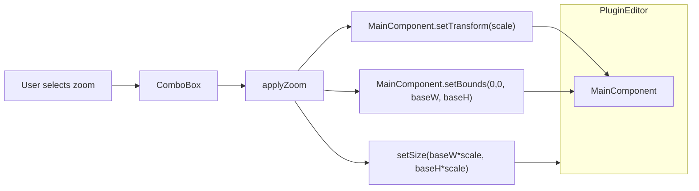

# Plan: GUI zoom functionality (issue #14)

## Contexte

- **Déjà en place :** [HeaderPanel](Source/GUI/Panels/MainComponent/HeaderPanel/HeaderPanel.cpp) avec ComboBox zoom (50 %–200 %), callback dans [PluginEditor](Source/GUI/PluginEditor.cpp) (l.47–56) qui ignore la valeur ; [PluginIDs::Settings::ZoomLevels](Source/Shared/Definitions/PluginIDs.h) avec `getZoomLevel(zoomLevelId)` et facteurs jusqu’à 400 % ; dimensions de base dans [PluginDimensions](Source/Shared/Definitions/PluginDimensions.h) (1335×810).
- **Objectif :** quand l’utilisateur change le niveau, redimensionner la fenêtre et appliquer un scale sur le contenu ; persister le choix ; rester cohérent avec HiDPI existant (widgets utilisent déjà `getPixelScale()` + `AffineTransform::scale` en paint).

## Architecture visuelle

- **Règle :** MainComponent garde toujours des bounds **logiques** (1335×810). L’éditeur prend la taille **physique** (base × scale). Le transform appliqué au MainComponent fait le rendu à l’échelle.

---

## Phase 1 – Zoom visuel (sans persistance)

### 1.1 Méthode centralisée dans PluginEditor

- **Fichier :** [Source/GUI/PluginEditor.h](Source/GUI/PluginEditor.h) et [Source/GUI/PluginEditor.cpp](Source/GUI/PluginEditor.cpp).
- Ajouter une méthode privée `void applyZoomLevel(float scale)` qui :
  - utilise les dimensions de base `PluginEditor::getWidth()` / `getHeight()` (ou `PluginDimensions::GUI::kWidth` / `kHeight`) ;
  - appelle `setSize(baseWidth * scale, baseHeight * scale)` ;
  - sur le `mainComponent` : `setBounds(0, 0, baseWidth, baseHeight)` puis `setTransform(juce::AffineTransform::scale(scale))` ;
  - appelle `repaint()` sur le mainComponent (ou l’éditeur) pour limiter les artéfacts de cache.
- Contrainte : une seule responsabilité (appliquer un scale donné), pas de lecture/écriture state dans cette phase.

### 1.2 Constructeur et bounds du MainComponent

- Dans le constructeur, après `addAndMakeVisible(*mainComponent)` : initialiser les bounds du mainComponent en **taille logique** : `mainComponent->setBounds(0, 0, getWidth(), getHeight())` (pas `getLocalBounds()`).
- Dans [PluginEditor::resized()](Source/GUI/PluginEditor.cpp) (l.67–71) : ne plus donner au mainComponent la taille de l’éditeur. Soit ne rien faire pour le mainComponent, soit réappliquer `setBounds(0, 0, getWidth(), getHeight())` pour garder une taille logique fixe (idempotent). Le transform sera appliqué uniquement dans `applyZoomLevel`.

### 1.3 Branchement du ComboBox zoom

- Dans le lambda `headerPanel.getZoomComboBox().onChange` (l.47–56) : capturer `this`, récupérer `selectedId`, calculer `scale = PluginIDs::Settings::ZoomLevels::getZoomLevel(selectedId)`, appeler `applyZoomLevel(scale)`. Supprimer le `juce::ignoreUnused` et le TODO.

### 1.4 Vérifications

- Tester au moins 50 %, 100 %, 200 % (affichage correct, pas de débordement). Si des widgets avec cache (ex. [TrackGeneratorDisplay](Source/GUI/Widgets/TrackGeneratorDisplay.cpp), [EnvelopeDisplay](Source/GUI/Widgets/EnvelopeDisplay.cpp)) montrent des artéfacts, ajouter une invalidation ciblée (repaint ou invalidation de cache) dans `applyZoomLevel`.

---

## Phase 2 – Persistance du zoom level

### 2.1 Clé de propriété state

- Définir une constante pour la propriété (ex. `"guiZoomLevelId"`) dans un endroit partagé (ex. [PluginIDs.h](Source/Shared/Definitions/PluginIDs.h) dans `PluginIDs::Settings`, ou identifiant dédié). Type stocké : `int` (ID du niveau, comme `ZoomLevels::k50` … `k400`).

### 2.2 Initialisation de la state

- Dans [PluginProcessor](Source/Core/PluginProcessor.cpp) : soit dans `initializeMidiPortProperties()`, soit dans une nouvelle fonction d’init d’état GUI appelée depuis le constructeur, ajouter : si `!apvts.state.hasProperty("guiZoomLevelId")` alors `apvts.state.setProperty("guiZoomLevelId", PluginIDs::Settings::ZoomLevels::k100, nullptr)`.

### 2.3 Restauration au démarrage de l’éditeur

- Dans le constructeur de [PluginEditor](Source/GUI/PluginEditor.cpp), après création du mainComponent et du headerPanel, **avant** de brancher les callbacks :
  - Lire `zoomLevelId = apvts.state.getProperty("guiZoomLevelId", PluginIDs::Settings::ZoomLevels::k100)` (avec cast/conversion si nécessaire pour le type `var`) ;
  - Appeler `applyZoomLevel(PluginIDs::Settings::ZoomLevels::getZoomLevel(zoomLevelId))` ;
  - Mettre à jour le ComboBox : `headerPanel.getZoomComboBox().setSelectedId(zoomLevelId, juce::dontSendNotification)`.

### 2.4 Sauvegarde à chaque changement

- Dans le callback `onChange` du ComboBox zoom, après `applyZoomLevel(scale)` : `pluginProcessor.getApvts().state.setProperty("guiZoomLevelId", selectedId, nullptr)`.

### 2.5 Vérifications

- Ouvrir le plugin, changer le zoom, sauvegarder le projet, rouvrir : le niveau doit être restauré. Nouveau projet : 100 % par défaut.

---

## Phase 3 – Finition (optionnel selon besoin)

- **Niveaux 250 %, 300 %, 400 % :** si souhaité (aligné avec l’issue #14), ajouter les entrées dans [PluginDisplayNames::ChoiceLists::ZoomLevels](Source/Shared/Definitions/PluginDisplayNames.h) (k250, k300, k400) et les `addItem` correspondants dans [HeaderPanel.cpp](Source/GUI/Panels/MainComponent/HeaderPanel/HeaderPanel.cpp). Les IDs et facteurs existent déjà dans PluginIDs.
- **Contraintes fenêtre :** pas de changement obligatoire ; si un host impose des min/max, le comportement actuel (setSize par l’éditeur) reste valide ; documenter ou tester si des cas limites apparaissent.
- **Caches :** n’ajouter une invalidation explicite (ex. sur les composants qui utilisent un cache image) que si des défauts visuels persistent après Phase 1.

---

## Fichiers principaux impactés

| Fichier                                                                        | Rôle                                                                         |
| ------------------------------------------------------------------------------ | ---------------------------------------------------------------------------- |
| [Source/GUI/PluginEditor.h](Source/GUI/PluginEditor.h)                         | Déclaration `applyZoomLevel(float)`                                          |
| [Source/GUI/PluginEditor.cpp](Source/GUI/PluginEditor.cpp)                     | Implémentation zoom, bounds, callback, lecture/écriture state                |
| [Source/Core/PluginProcessor.cpp](Source/Core/PluginProcessor.cpp)             | Init propriété `guiZoomLevelId` si absente                                   |
| [Source/Shared/Definitions/PluginIDs.h](Source/Shared/Definitions/PluginIDs.h) | Constante clé state (optionnel, peut être en littéral dans un premier temps) |

Phase 3 : [PluginDisplayNames.h](Source/Shared/Definitions/PluginDisplayNames.h), [HeaderPanel.cpp](Source/GUI/Panels/MainComponent/HeaderPanel/HeaderPanel.cpp).

---

## Ordre d’exécution recommandé

1. Phase 1 en entier (zoom visuel uniquement), tests manuels.
2. Phase 2 (persistance), tests sauvegarde/chargement.
3. Phase 3 si tu veux les niveaux 250–400 % ou si des correctifs caches/contraintes sont nécessaires.

Après validation du plan, l’archiver dans `Documentation/Development/Plans/2026/` avec la convention de nommage (date, titre en anglais, mots capitalisés, tirets).