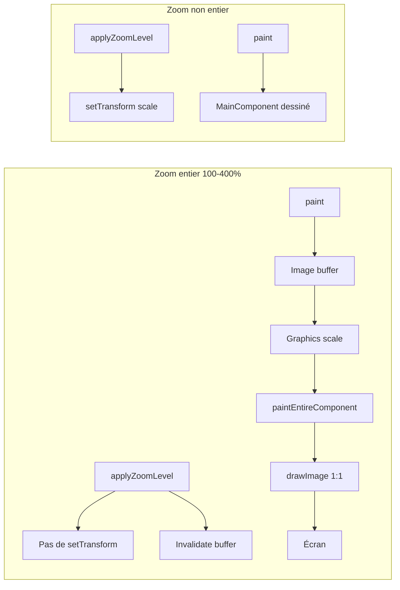

# Plan: Rendu net aux zooms entiers (expérimentation en branche)

## Objectif

À 200 % (et 100 %, 300 %, 400 %), éviter l’interpolation introduite par `setTransform()` sur le `MainComponent` en utilisant un **buffer image à la taille physique cible** et un **affichage 1:1**, tout en conservant le comportement actuel (transform) pour les zooms non entiers.

## Contexte technique

- **Actuel :** [PluginEditor::applyZoomLevel](Source/GUI/PluginEditor.cpp) fait `mainComponent->setTransform(AffineTransform::scale(scale))`. Le rendu du composant transformé par JUCE/OS peut utiliser une interpolation, d’où le flou à 200 %.
- **Cible :** Pour les scales entiers (1.0, 2.0, 3.0, 4.0), ne plus scaler un composant déjà dessiné ; dessiner une fois dans une image à la résolution finale, puis afficher cette image sans redimensionnement supplémentaire.

## Branche et périmètre

- **Branche :** créer une branche courte à partir de `main` (ex. `feature/zoom-integer-scale-rendering`).
- **Fichiers principaux :** [Source/GUI/PluginEditor.h](Source/GUI/PluginEditor.h), [Source/GUI/PluginEditor.cpp](Source/GUI/PluginEditor.cpp). Aucun changement dans les widgets ni dans `MainComponent`.

---

## Architecture du rendu

- **Zoom entier :** pas de transform sur le `MainComponent` ; en `paint()`, remplir une image puis la dessiner à taille éditeur avec qualité de resampling basse.
- **Zoom non entier :** comportement actuel inchangé (setTransform + bounds logiques).

---

## Étapes d’implémentation

### 1. Créer la branche

- À partir de `main` à jour : `git checkout -b feature/zoom-integer-scale-rendering` (ou nom équivalent).

### 2. Détecter les niveaux de zoom entiers

- Introduire une fonction (libre ou privée) du type `isIntegerZoomLevel(float scale)` qui renvoie `true` pour 1.0f, 2.0f, 3.0f, 4.0f (comparaison avec une tolérance pour les float, ex. `std::abs(scale - std::round(scale)) < 1e-5f`).
- Utiliser cette fonction pour choisir entre le chemin « buffer » et le chemin « setTransform » partout où le zoom est appliqué.

### 3. Adapter `applyZoomLevel` selon le mode

- **Zoom entier :**
  - Conserver : `setSize(baseWidth * scale, baseHeight * scale)`.
  - Pour le `mainComponent` : `setBounds(0, 0, baseWidth, baseHeight)` et `**setTransform(AffineTransform())`** (identité), pour que le composant reste en taille logique et ne soit plus scalé par une transform.
  - Marquer le buffer zoom comme invalide (voir ci‑dessous).
- **Zoom non entier :**
  - Comportement actuel : `setBounds(0, 0, baseWidth, baseHeight)` et `setTransform(AffineTransform::scale(scale))`.
- Dans les deux cas, appeler `repaint()` (ou invalidation équivalente) après mise à jour.

### 4. Buffer image et `paint()` pour zoom entier

- **Membre :** dans [PluginEditor.h](Source/GUI/PluginEditor.h), ajouter un `juce::Image` (ex. `integerZoomBuffer_`) et optionnellement un `float cachedIntegerZoomScale_` pour savoir quand recalculer le buffer (scale ou taille changés).
- **Taille du buffer :** en pixels physiques pour correspondre au backing store. Obtenir le facteur d’échelle écran comme dans les widgets (ex. `Desktop::getInstance().getDisplays().getDisplayForRect(getScreenBounds())->scale`).  
Taille image = `(baseWidth * scale * displayScale)` × `(baseHeight * scale * displayScale)` (arrondi en entiers). Si le composant n’est pas encore sur l’écran, utiliser un display par défaut (ex. primary) et un scale 1.f en secours.
- **Remplissage du buffer :**
  - Créer ou redimensionner l’image si nécessaire (scale ou taille éditeur changés).
  - `juce::Graphics g(image)` ; `g.addTransform(juce::AffineTransform::scale(scale))` ; `mainComponent->paintEntireComponent(g, false)`.
  - Ainsi le contenu logique 1335×810 est dessiné une fois, avec le zoom appliqué, directement à la résolution cible (les widgets gardent leur `getPixelScale()` interne).
- **Affichage dans `PluginEditor::paint()` :**
  - Si zoom entier et buffer valide : dessiner le fond (ex. `fillAll` comme aujourd’hui), puis dessiner l’image pour couvrir toute la surface de l’éditeur (ex. `getLocalBounds()`). Utiliser une qualité de resampling basse (ex. `Graphics::lowResamplingQuality` ou équivalent JUCE) pour limiter l’interpolation si le moteur fait un léger redimensionnement.
  - Si zoom non entier : comportement actuel (pas de dessin du buffer ; le `MainComponent` est dessiné par JUCE avec sa transform).

### 5. Invalidation du buffer

- Invalider (ou vider) le buffer quand :
  - le niveau de zoom change (dans `applyZoomLevel`, chemin zoom entier),
  - le scale change (même chemin),
  - la taille de l’éditeur change (ex. dans `resized()` si on utilise le chemin buffer),
  - le skin change (dans `updateSkin()`), pour éviter un contenu obsolète.
- Recréer le buffer à la prochaine `paint()` si le zoom est entier et que le buffer est invalide ou de mauvaise taille.

### 6. `resized()` et visibilité du MainComponent

- **Zoom entier :** le `MainComponent` reste en bounds logiques (0, 0, baseWidth, baseHeight) et transform identité ; il est dessiné uniquement via le buffer dans `paint()`. S’assurer qu’il ne soit pas dessiné une seconde fois par JUCE (par ex. le garder visible pour le hit-test et le focus, mais le rendu effectif peut être uniquement via le buffer ; selon JUCE, éventuellement masquer le dessin direct du MainComponent quand on utilise le buffer, ou laisser JUCE le dessiner sous le buffer — dans ce cas il faudra que le buffer soit opaque et couvre tout pour éviter le double rendu).
- **Clarification :** si en mode zoom entier on dessine le buffer dans `PluginEditor::paint()` par-dessus la zone du MainComponent, le MainComponent est en dessous ; comme le buffer couvre toute la surface, on peut laisser le MainComponent visible (il sera masqué par le buffer). Sinon, documenter ou adapter (ex. `setVisible(false)` sur le MainComponent en mode buffer puis `setVisible(true)` en mode transform) selon le comportement observé.
- **Zoom non entier :** garder la logique actuelle dans `resized()` (bounds logiques sur le MainComponent).

### 7. Tests et validation

- Vérifier 100 %, 200 %, 300 %, 400 % : netteté perçue sur Retina, pas de régression visuelle (alignements, clipping).
- Vérifier 50 %, 75 %, 90 %, 125 %, 150 %, 250 % : comportement identique à aujourd’hui (léger flou acceptable).
- Vérifier changement de zoom (entier → non entier et inverse) : pas d’artéfacts, buffer bien invalidé.
- Vérifier changement de skin : contenu à jour en zoom entier.
- Tester un repaint après une action (ex. focus, survol) pour s’assurer que le buffer est bien utilisé et qu’il n’y a pas de flicker.

### 8. Clôture de l’expérimentation

- Si le rendu est satisfaisant : merge de la branche dans `main`, puis tag si besoin.
- Si abandon : suppression de la branche, `main` inchangé.

---

## Points d’attention

- **Mémoire :** le buffer fait environ `(1335 * scale * displayScale) * (810 * scale * displayScale) * 4` octets (ARGB). À 200 % sur 2x : ~67 Mpx × 4 ≈ 268 Mo. Vérifier que la taille est raisonnable (JUCE Image en ARGB). Si besoin, limiter l’usage du buffer à 200 % uniquement dans un premier temps.
- **Performance :** un `paintEntireComponent` complet à chaque `paint()` peut être coûteux. Si nécessaire, ne recalculer le buffer que lorsque le zoom, la taille ou le skin changent, et en `paint()` ne faire que `drawImage` du buffer (cache).
- **API JUCE :** confirmer dans la doc JUCE 8 la signature exacte de `paintEntireComponent` et la façon de définir la qualité de resampling pour `drawImage` (ex. `setImageResamplingQuality` ou équivalent).

---

## Fichiers impactés (résumé)

| Fichier                                                    | Modifications                                                                                                                                                                                 |
| ---------------------------------------------------------- | --------------------------------------------------------------------------------------------------------------------------------------------------------------------------------------------- |
| [Source/GUI/PluginEditor.h](Source/GUI/PluginEditor.h)     | Image buffer (et optionnellement scale en cache), déclaration helper `isIntegerZoomLevel` si membre.                                                                                          |
| [Source/GUI/PluginEditor.cpp](Source/GUI/PluginEditor.cpp) | `applyZoomLevel` (branche entier / non entier), `paint()` (dessin buffer pour zoom entier), invalidation buffer dans `applyZoomLevel` et `updateSkin`, calcul display scale et taille buffer. |

Aucun changement dans les widgets, `MainComponent`, ou `PluginProcessor`.