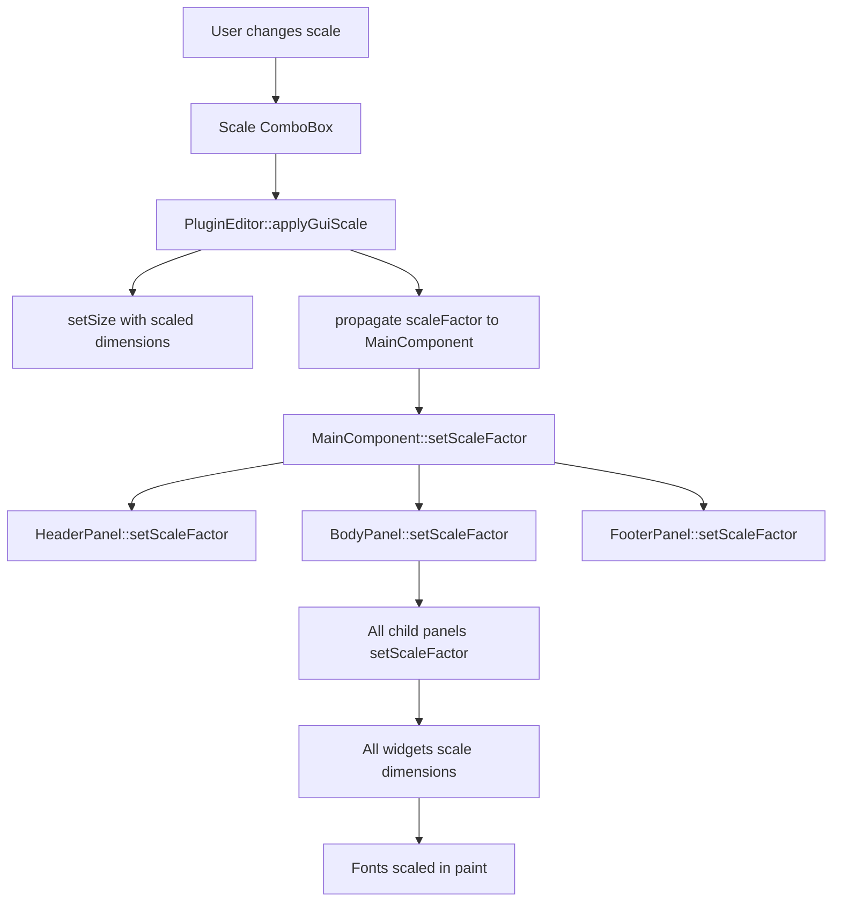

# Plan : Rendu direct avec propagation du scale factor

## Contexte

**Problème actuel** : L'approche `setTransform(AffineTransform::scale())` appliquée sur le MainComponent crée un flou visible, particulièrement sur les écrans non-Retina en résolution native.

**Solution proposée** : Propager le `scaleFactor` dans toute la hiérarchie de composants pour que chacun se redimensionne physiquement (pas de transform), obtenant ainsi un rendu vectoriel net à toutes les échelles.

## Architecture cible

## Stratégie d'implémentation

### Phase 1 : Infrastructure de base

#### 1.1 Créer une nouvelle branche

- Branche : `feature/direct-rendering-scale`
- Partir de `main` (tag `v0.0.63-alpha`)

#### 1.2 Ajouter le scaleFactor dans MainComponent

[MainComponent.h](Source/GUI/MainComponent.h) :

- Ajouter membre privé : `float scaleFactor_ = 1.0f;`
- Ajouter méthode publique : `void setScaleFactor(float scale);`
- Ajouter méthode privée helper : `int scaled(int value) const { return juce::roundToInt(value * scaleFactor_); }`

[MainComponent.cpp](Source/GUI/MainComponent.cpp) :

- Implémenter `setScaleFactor()` :
  - Stocker le nouveau scale
  - Propager aux 3 panels (Header, Body, Footer)
  - Appeler `resized()` pour recalculer layout
- Modifier `resized()` pour utiliser dimensions scalées :
  - `scaled(PluginDimensions::Panels::Header::kHeight)`
  - `scaled(PluginDimensions::Panels::Body::kHeight)`
  - `scaled(PluginDimensions::Panels::Footer::kHeight)`

#### 1.3 Modifier PluginEditor

[PluginEditor.cpp](Source/GUI/PluginEditor.cpp) :

- Dans `applyGuiScale(float scaleFactor)` :
  - **SUPPRIMER** : `mainComponent->setTransform(AffineTransform::scale(scaleFactor))`
  - **AJOUTER** : `mainComponent->setScaleFactor(scaleFactor)`
  - Conserver : `setSize(baseWidth * scaleFactor, baseHeight * scaleFactor)`
  - Conserver : `mainComponent->setBounds(0, 0, baseWidth * scaleFactor, baseHeight * scaleFactor)` (taille physique!)

### Phase 2 : Propagation dans les panels principaux

#### 2.1 HeaderPanel

[HeaderPanel.h](Source/GUI/Panels/MainComponent/HeaderPanel/HeaderPanel.h) :

- Ajouter membre : `float scaleFactor_ = 1.0f;`
- Ajouter méthode : `void setScaleFactor(float scale);`
- Ajouter helper : `int scaled(int value) const;`

[HeaderPanel.cpp](Source/GUI/Panels/MainComponent/HeaderPanel/HeaderPanel.cpp) :

- Modifier constructeur : stocker `width` et `height` comme tailles de base (non scalées)
- Implémenter `setScaleFactor()` :
  - Stocker scale
  - Appeler `resized()`
  - Propager aux widgets (labels, comboboxes)
- Modifier `resized()` pour utiliser dimensions scalées
- Modifier `paint()` si nécessaire (probablement pas)

#### 2.2 BodyPanel

[BodyPanel.h](Source/GUI/Panels/MainComponent/BodyPanel/BodyPanel.h) :

- Ajouter membre : `float scaleFactor_ = 1.0f;`
- Ajouter méthode : `void setScaleFactor(float scale);`

[BodyPanel.cpp](Source/GUI/Panels/MainComponent/BodyPanel/BodyPanel.cpp) :

- Implémenter `setScaleFactor()` :
  - Stocker scale
  - Propager à tous les child panels (PatchEditPanel, MatrixModulationPanel, etc.)
  - Appeler `resized()`
- Modifier `resized()` pour utiliser dimensions scalées

#### 2.3 FooterPanel

[FooterPanel.h](Source/GUI/Panels/MainComponent/FooterPanel/FooterPanel.h) :

- Ajouter membre : `float scaleFactor_ = 1.0f;`
- Ajouter méthode : `void setScaleFactor(float scale);`

[FooterPanel.cpp](Source/GUI/Panels/MainComponent/FooterPanel/FooterPanel.cpp) :

- Implémenter `setScaleFactor()` :
  - Stocker scale
  - Appeler `resized()` et `repaint()`
- Modifier `paint()` pour utiliser dimensions scalées (texte, icons)

### Phase 3 : Propagation dans les sous-panels

Pour TOUS les panels listés par Glob (31 fichiers) :

#### Pattern à répéter pour chaque panel

**Exemple : PatchEditPanel, MasterEditPanel, etc.**

Headers :

- Ajouter `float scaleFactor_ = 1.0f;`
- Ajouter `void setScaleFactor(float scale);`
- Ajouter helper `int scaled(int value) const;`

Implémentations :

- `setScaleFactor()` propage aux enfants puis appelle `resized()`
- `resized()` utilise `scaled(PluginDimensions::...)` partout
- Constructeurs stockent dimensions de base (non scalées)

**Ordre de priorité** (tester au fur et à mesure) :

1. PatchEditPanel (très visible)
2. MasterEditPanel (visible)
3. MatrixModulationPanel (visible)
4. PatchManagerPanel (visible)
5. Tous les sous-modules

### Phase 4 : Widgets

#### 4.1 Widgets custom (namespace tss)

Pour chaque widget custom qui dessine du contenu :

[Source/GUI/Widgets/*.h](Source/GUI/Widgets/) :

- Ajouter `float scaleFactor_ = 1.0f;`
- Ajouter `void setScaleFactor(float scale);`

Implémentations :

- `paint()` : scaler les dimensions, épaisseurs de ligne, positions
- Fonts : `font.withHeight(baseHeight * scaleFactor_)`
- Ne PAS modifier la taille du composant (géré par le parent)

**Widgets prioritaires** :

- Slider
- ComboBox
- Button
- Label
- EnvelopeDisplay
- TrackGeneratorDisplay
- NumberBox

#### 4.2 WidgetFactory

[WidgetFactory.h](Source/GUI/Factories/WidgetFactory.h) :

- Ajouter méthode helper : `void propagateScale(float scale, std::vector<Widget*> widgets);`

[WidgetFactory.cpp](Source/GUI/Factories/WidgetFactory.cpp) :

- Implémenter propagation en masse si nécessaire

### Phase 5 : Tests et optimisation

#### 5.1 Tests de rendu

Tester sur :

- Ecran Retina MacBook : 50%, 100%, 150%, 200%
- Ecran LG résolution native : 50%, 100%, 150%, 200%
- Ecran LG HiDPI : 50%, 100%, 150%, 200%

Vérifier :

- Netteté du texte
- Netteté des bordures
- Alignement pixel-perfect
- Pas de clipping
- Pas d'artéfacts

#### 5.2 Tests de performance

- Mesurer temps de `setScaleFactor()` (doit être < 100ms)
- Mesurer temps de `paint()` (doit rester identique)
- Vérifier pas de fuites mémoire

#### 5.3 Tests d'interaction

- ComboBoxes cliquables
- Sliders draggables
- Focus clavier
- Hover states
- Changement de skin

### Phase 6 : Cleanup et finition

#### 6.1 Supprimer code obsolète

- Vérifier qu'aucun `setTransform()` ne reste dans le code
- Supprimer helpers inutilisés

#### 6.2 Documentation

- Mettre à jour [GUI-Implementation-Details.md](Documentation/Development/GUI/GUI-Implementation-Details.md) :
  - Expliquer approche scale factor propagation
  - Documenter méthode `setScaleFactor()` pattern
  - Ajouter note sur performances

#### 6.3 Commit et merge

Si succès :

- Commit sur branche : "Implement direct rendering with scale factor propagation"
- Merge dans `main`
- Tag : `v0.0.64-alpha`

Si échec :

- Supprimer branche
- `main` reste intact au tag `v0.0.63-alpha`

## Points critiques

### Performance

- **Risque** : Recalcul complet du layout à chaque changement de scale
- **Mitigation** : Cacher les calculs coûteux, optimiser `resized()`

### Complexité

- **31 panels** + ~15 widgets à modifier
- **Estimation** : 2-3 jours de travail
- **Stratégie** : Implémenter progressivement, tester souvent

### Fonts

- Tous les `Font::withHeight()` doivent être scalés
- Vérifier que le rendering reste net

### Rétrocompatibilité

- Comportement par défaut (scale 1.0) doit être identique à avant
- Pas de régression sur layout existant

## Fichiers impactés (résumé)

| Fichier                                                                        | Modification                              |
| ------------------------------------------------------------------------------ | ----------------------------------------- |
| [PluginEditor.cpp](Source/GUI/PluginEditor.cpp)                                | Remplacer setTransform par setScaleFactor |
| [MainComponent.h/cpp](Source/GUI/MainComponent.h)                              | Ajouter scaleFactor, propagation          |
| [HeaderPanel.h/cpp](Source/GUI/Panels/MainComponent/HeaderPanel/HeaderPanel.h) | Ajouter scaleFactor, layout scalé         |
| [BodyPanel.h/cpp](Source/GUI/Panels/MainComponent/BodyPanel/BodyPanel.h)       | Ajouter scaleFactor, propagation          |
| [FooterPanel.h/cpp](Source/GUI/Panels/MainComponent/FooterPanel/FooterPanel.h) | Ajouter scaleFactor, layout scalé         |
| **31 sous-panels**                                                             | Pattern identique pour chaque             |
| **~15 widgets**                                                                | Scaler dimensions et fonts dans paint()   |

## Ordre d'exécution recommandé

1. Créer branche `feature/direct-rendering-scale`
2. Phase 1 : Infrastructure (MainComponent, PluginEditor)
3. Phase 2 : Panels principaux (Header, Body, Footer)
4. Compiler et tester rendu de base
5. Phase 3 : Sous-panels (itératif, tester souvent)
6. Phase 4 : Widgets (itératif, tester souvent)
7. Phase 5 : Tests complets sur 3 configurations écran
8. Phase 6 : Cleanup, doc, commit/merge ou abandon

## Alternative : Approche incrémentale

Si l'approche complète est trop lourde, possibilité de :

1. Implémenter uniquement pour 100% et 200% d'abord
2. Garder setTransform() pour les autres scales
3. Valider le principe avant de généraliser

