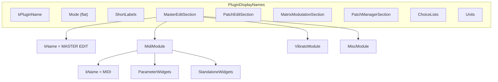

# Plan de refactorisation : PluginDisplayNames.h et PluginIDs.h

## Conventions validées

- **Pyramide** : Section puis Module puis ParameterWidgets/StandaloneWidgets (ou Header/ModulationBus pour Matrix Modulation).
- **Nommage** : `XxxSection` (ex. MasterEditSection), `YyyModule` (ex. MidiModule) pour faire apparaître le type dans le chemin.
- **Nom d’affichage / ID de groupe** : `kName` pour les libellés, `kGroupId` pour les IDs de groupe (approche 2 : une constante par "feuille").
- **Namespace racine** : `PluginDisplayNames` dans [PluginDisplayNames.h](Source/Shared/PluginDisplayNames.h), `PluginIDs` dans [PluginIDs.h](Source/Shared/PluginIDs.h) (plus d’enveloppe `PluginDescriptors` dans ces fichiers).

---

## Partie 1 – Refactorisation de PluginDisplayNames.h

### 1.1 Structure cible

- **Racine** : Remplacer `namespace PluginDescriptors { namespace DisplayNames {` par `namespace PluginDisplayNames {`. Supprimer l’accolade fermante et le `}` de `PluginDescriptors` en fin de fichier.
- **Mode** : Conserver tel quel (flat : `kMaster`, `kPatch`).
- **Supprimer** le namespace `Section` : les libellés de section ne vivent plus dans une liste plate ; chaque section les porte en `kName`.
- **Supprimer** le namespace `Module` (et les commentaires "Master Edit Modules", etc.) : chaque module porte son libellé en `kName` dans la pyramide.
- **MasterEdit** → **MasterEditSection** :
  - Ajouter `kName = "MASTER EDIT"`.
  - Renommer `Midi` → `MidiModule`, ajouter `kName = "MIDI"` ; garder ParameterWidgets et StandaloneWidgets.
  - Même schéma pour `VibratoModule`, `MiscModule`.
- **PatchEdit** → **PatchEditSection** :
  - Ajouter `kName = "PATCH EDIT"`.
  - Renommer chaque sous-namespace en XxxModule (Dco1Module, Dco2Module, VcfVcaModule, FmTrackModule, RampPortamentoModule, Envelope1Module, Envelope2Module, Envelope3Module, Lfo1Module, Lfo2Module, PatchNameModule) et ajouter dans chacun `kName` avec le libellé actuel (ex. "DCO 1", "PATCH NAME").
- **MatrixModulation** → **MatrixModulationSection** :
  - Ajouter `kName = "MATRIX MODULATION"`.
  - Garder `Header` et `ModulationBus` sans suffixe Module.
- **PatchManager** → **PatchManagerSection** :
  - Ajouter `kName = "PATCH MANAGER"`.
  - Renommer BankUtility → BankUtilityModule (avec `kName = "BANK UTILITY"`), InternalPatches → InternalPatchesModule, ComputerPatches → ComputerPatchesModule, PatchMutator → PatchMutatorModule, chacun avec son `kName`.
- **ShortLabels, ChoiceLists, Units** : Inchangés (ChoiceLists avec ModulationBus::Source et ModulationBus::Destination, Units en frère de ChoiceLists). Rester sous `PluginDisplayNames`.

Alignement des `=` en colonne 64 à conserver.

### 1.2 Mise à jour des références (Partie 1)

- Remplacer partout **`PluginDescriptors::DisplayNames::`** par **`PluginDisplayNames::`** (fichiers concernés : [PluginDescriptors.cpp](Source/Shared/PluginDescriptors.cpp), [PatchMutatorPanel.cpp](Source/GUI/Panels/MainComponent/BodyPanel/PatchManagerPanel/Modules/PatchMutatorPanel.cpp), [MatrixModulationPanel.cpp](Source/GUI/Panels/MainComponent/BodyPanel/MatrixModulationPanel/MatrixModulationPanel.cpp), [ModulationBusPanel.cpp](Source/GUI/Panels/Reusable/ModulationBusPanel.cpp), [ModulationBusHeader.cpp](Source/GUI/Widgets/ModulationBusHeader.cpp), [PatchNameDisplay.cpp](Source/GUI/Widgets/PatchNameDisplay.cpp), [ComputerPatchesPanel.cpp](Source/GUI/Panels/MainComponent/BodyPanel/PatchManagerPanel/Modules/ComputerPatchesPanel.cpp), [InternalPatchesPanel.cpp](Source/GUI/Panels/MainComponent/BodyPanel/PatchManagerPanel/Modules/InternalPatchesPanel.cpp), [BankUtilityPanel.cpp](Source/GUI/Panels/MainComponent/BodyPanel/PatchManagerPanel/Modules/BankUtilityPanel.cpp), [MiddlePanel.cpp](Source/GUI/Panels/MainComponent/BodyPanel/PatchEditPanel/MiddlePanel/MiddlePanel.cpp), etc.).
- Remplacer les usages des noms de **section** :  
  `DisplayNames::Section::kMasterEdit` → `PluginDisplayNames::MasterEditSection::kName` (et idem pour kPatchEdit, kMatrixModulation, kPatchManager).
- Remplacer les usages des noms de **module** :  
  `DisplayNames::Module::kMidi` → `PluginDisplayNames::MasterEditSection::MidiModule::kName` ;  
  `DisplayNames::Module::kDco1` → `PluginDisplayNames::PatchEditSection::Dco1Module::kName` ; etc. pour tous les modules (y compris Patch Manager).
- Les chemins du type `DisplayNames::MasterEdit::Midi::ParameterWidgets::kChannel` deviennent `PluginDisplayNames::MasterEditSection::MidiModule::ParameterWidgets::kChannel` (et équivalents pour toutes les sections/modules).
- Vérifier les références à `ShortLabels`, `ChoiceLists`, `Units` (préfixe `PluginDisplayNames::` uniquement si ce n’est pas déjà fait).

[PluginDescriptors.h](Source/Shared/PluginDescriptors.h) inclut déjà [PluginDisplayNames.h](Source/Shared/PluginDisplayNames.h) ; il n’a pas besoin d’être renommé, seul le namespace utilisé dans les descripteurs change (PluginDisplayNames au lieu de PluginDescriptors::DisplayNames).

---

## Partie 2 – Refactorisation de PluginIDs.h

### 2.1 Structure cible (approche 2 : une constante par feuille)

- **Racine** : Remplacer `namespace PluginDescriptors {` par `namespace PluginIDs {` dans [PluginIDs.h](Source/Shared/PluginIDs.h). Fermer par `} // namespace PluginIDs`.
- **Modes** : Conserver des IDs de groupe pour les modes. Par ex. `namespace Mode { constexpr const char* kMaster = "masterMode"; constexpr const char* kPatch = "patchMode"; }` (au lieu de `ModeIds`).
- **Sections** : Chaque section devient un namespace avec `kGroupId` :
  - `MasterEditSection::kGroupId` (= valeur actuelle de SectionIds::kMasterEdit), puis sous-namespaces par module.
  - Idem pour PatchEditSection, MatrixModulationSection, PatchManagerSection.
- **Modules sous chaque section** : Chaque module a son propre namespace avec `kGroupId` et les sous-namespaces pour paramètres et widgets :
  - **MasterEditSection** : MidiModule (kGroupId, ParameterWidgets::kChannel, kMidiEcho, … ; StandaloneWidgets::kInit), VibratoModule, MiscModule.
  - **PatchEditSection** : Dco1Module, Dco2Module, VcfVcaModule, FmTrackModule, RampPortamentoModule, Envelope1Module, Envelope2Module, Envelope3Module, Lfo1Module, Lfo2Module, PatchNameModule — chacun avec kGroupId et ParameterWidgets / StandaloneWidgets contenant les IDs existants (mêmes noms de constantes, déplacés sous la pyramide).
  - **MatrixModulationSection** : kGroupId ; Header (si des IDs y sont nécessaires) ; ModulationBus avec kBus0 … kBus9 (valeurs actuelles de ModulationBusIds::kModulationBus0 … kModulationBus9). Les paramètres par bus (Source, Amount, Destination) peuvent vivre sous MatrixModulationSection::ModulationBus::Bus0, Bus1, … Bus9 avec kSource, kAmount, kDestination chacun, ou rester dans un sous-namespace dédié tant que le chemin reflète la hiérarchie.
  - **PatchManagerSection** : kGroupId ; BankUtilityModule (kGroupId, StandaloneWidgets::…), InternalPatchesModule, ComputerPatchesModule, PatchMutatorModule.
- **ParameterGroupIds** (internalPatchesBrowserGroup, computerPatchesBrowserGroup, etc.) : Les placer sous le module concerné (ex. InternalPatchesModule::kBrowserGroupId, kMemoryGroupId ; ComputerPatchesModule::kBrowserGroupId, kStorageGroupId) pour rester dans la pyramide.
- **kModulationBusCount** : Le laisser dans PluginIDs (ex. `constexpr int kModulationBusCount = 10;`) pour les tableaux et boucles. Les usages actuels `PluginDescriptors::kModulationBusCount` deviennent `PluginIDs::kModulationBusCount` (ou, si on garde la constante dans PluginDescriptors pour les types qui y sont définis, on peut garder une constante dans PluginDescriptors qui référence 10 ; le plan recommande de la garder dans PluginIDs et d’utiliser `PluginIDs::kModulationBusCount` partout).
- **Boucles / lookup** : Pour les 10 bus, fournir une liste dérivée (sans casser la pyramide) : par ex. dans PluginIDs.h ou dans un .cpp dédié, définir `const std::array<const char*, kModulationBusCount> kModulationBusGroupIds = { MatrixModulationSection::ModulationBus::kBus0, ..., kBus9 };` et une fonction ou accès par index si nécessaire (ou garder `getBusId(int)` dans ApvtsFactory en l’alimentant à partir de ce tableau). Même idée pour les paramètres Source/Amount/Destination par bus si on les met sous Bus0…Bus9 : construire des tableaux à partir des constantes de la pyramide.

### 2.2 Mapping des anciens noms vers la pyramide (exemples)

| Actuel | Cible |
|--------|--------|
| ModeIds::kMaster | PluginIDs::Mode::kMaster |
| SectionIds::kMasterEdit | PluginIDs::MasterEditSection::kGroupId |
| ModuleIds::kMidi | PluginIDs::MasterEditSection::MidiModule::kGroupId |
| ParameterIds::kMidiChannel | PluginIDs::MasterEditSection::MidiModule::ParameterWidgets::kChannel |
| StandaloneWidgetIds::kMidiInit | PluginIDs::MasterEditSection::MidiModule::StandaloneWidgets::kInit |
| ModulationBusIds::kModulationBus0 | PluginIDs::MatrixModulationSection::ModulationBus::kBus0 |

(Adapter pour tous les paramètres et widgets selon la même logique.)

### 2.3 Fichiers à mettre à jour (Partie 2)

- [PluginIDs.h](Source/Shared/PluginIDs.h) : réécriture de la structure (namespaces et déplacement des constantes).
- [PluginDescriptors.h](Source/Shared/PluginDescriptors.h) : les types (ApvtsGroupDescriptor, etc.) et constantes (kNoParentId, kModulationBusCount pour les `std::array`) utilisent les IDs ; remplacer les références à `ModeIds`, `SectionIds`, `ModuleIds`, `ModulationBusIds` par les nouveaux chemins `PluginIDs::...`. Si kModulationBusCount est déplacé dans PluginIDs, utiliser `PluginIDs::kModulationBusCount` dans les déclarations de tableaux.
- [PluginDescriptors.cpp](Source/Shared/PluginDescriptors.cpp) : mise à jour de toutes les références aux IDs (groupes, paramètres, widgets) vers la pyramide PluginIDs.
- [ApvtsFactory.cpp](Source/Core/Factories/ApvtsFactory.cpp) / [ApvtsFactory.h](Source/Core/Factories/ApvtsFactory.h) : getBusId et boucles sur kModulationBusCount utilisent les nouveaux chemins et, si défini, le tableau kModulationBusGroupIds (ou équivalent).
- [MatrixModulationPanel.cpp](Source/GUI/Panels/MainComponent/BodyPanel/MatrixModulationPanel/MatrixModulationPanel.cpp) / .h : createBusIds(), createSourceParameterIds(), etc. et types `std::array<..., kModulationBusCount>` — utiliser PluginIDs::kModulationBusCount et les constantes de la pyramide (éventuellement via un tableau dérivé).
- [WidgetFactory.cpp](Source/GUI/Factories/WidgetFactory.cpp), [PluginProcessor.cpp](Source/Core/PluginProcessor.cpp), et tous les panels (MidiPanel, VibratoPanel, MiscPanel, Dco1Panel, …) : remplacer les références aux anciens ParameterIds / StandaloneWidgetIds / ModuleIds / SectionIds par les chemins PluginIDs::XxxSection::YyyModule::....

---

## Ordre d’exécution recommandé

1. **Partie 1** : Refactoriser [PluginDisplayNames.h](Source/Shared/PluginDisplayNames.h) (structure + kName), puis mettre à jour tous les usages (PluginDescriptors::DisplayNames → PluginDisplayNames, Section:: → XxxSection::kName, Module:: → XxxSection::YyyModule::kName, MasterEdit:: → MasterEditSection::, etc.). Compilation et tests.
2. **Partie 2** : Refactoriser [PluginIDs.h](Source/Shared/PluginIDs.h) (namespace PluginIDs, pyramide Section/Module, kGroupId et constantes par feuille), ajouter si besoin kModulationBusGroupIds (ou équivalent) et garder kModulationBusCount ; mettre à jour [PluginDescriptors.h](Source/Shared/PluginDescriptors.h) et [PluginDescriptors.cpp](Source/Shared/PluginDescriptors.cpp), ApvtsFactory, MatrixModulationPanel, WidgetFactory, PluginProcessor et tous les panels. Compilation et tests.

---

## Risques et points d’attention

- **Partie 1** : Nombreux fichiers touchent aux display names ; vérifier chaque fichier listé en 1.2 pour ne pas manquer de référence (grep sur `DisplayNames::`, `Section::`, `Module::`, `MasterEdit::`, `PatchEdit::`, `MatrixModulation::`, `PatchManager::`).
- **Partie 2** : Les boucles sur les 10 bus et les tableaux de descripteurs (kModulationBusIntParameters, kModulationBusChoiceParameters) dépendent de kModulationBusCount et des IDs par index ; s’assurer que le tableau des bus IDs (kModulationBusGroupIds ou getBusId) est défini et cohérent avec la pyramide.
- **PluginDescriptors** : Reste le namespace des *structures* et listes de descripteurs (ApvtsGroupDescriptor, kAllApvtsGroups, etc.) ; il continue d’inclure PluginIDs.h et PluginDisplayNames.h et d’utiliser leurs constantes avec les nouveaux chemins.
