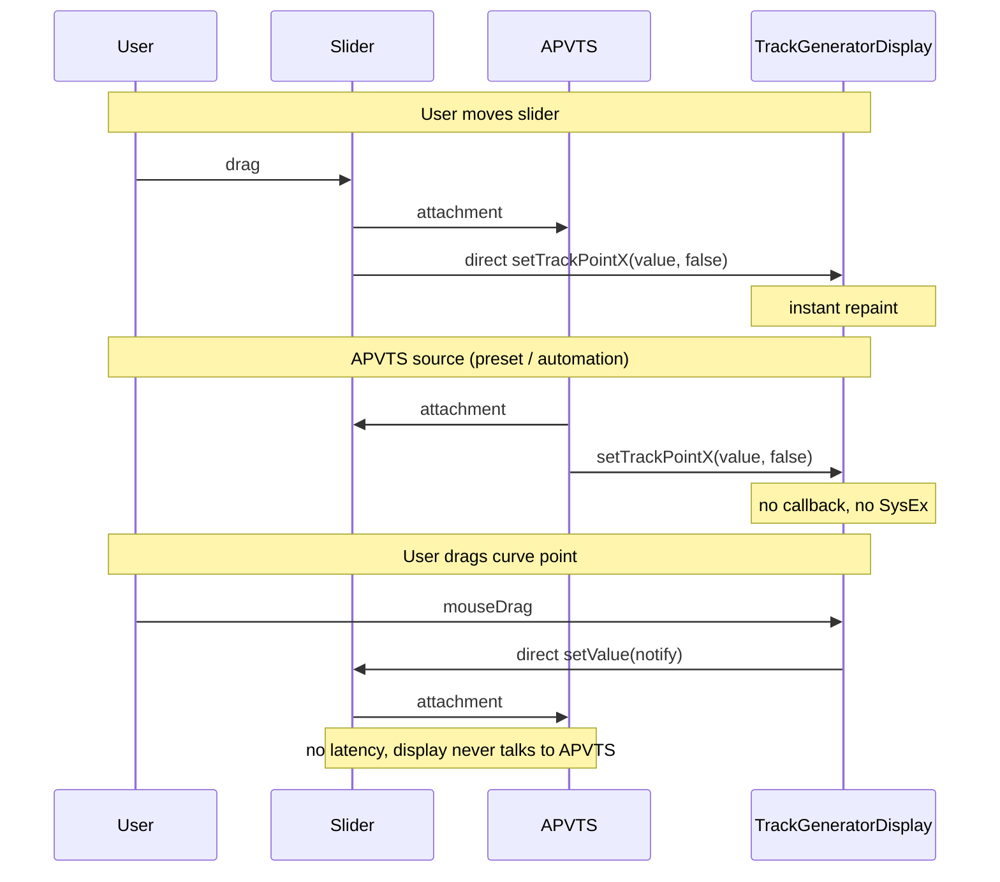

# Communication directe TrackGeneratorDisplay / Sliders TRACK POINT

## Objectif

- **Affichage réactif** : quand l’utilisateur bouge un slider TRACK POINT, mettre à jour le TrackGeneratorDisplay immédiatement (sans attendre le round-trip APVTS).
- **Mise à jour silencieuse** : quand la source est l’APVTS (preset, automation), mettre à jour le display sans déclencher le callback (pas d’envoi SysEx).
- **Conserver** : seuls les **5 sliders** sont connectés bidirectionnellement à l’APVTS (attachments). Le **TrackGeneratorDisplay** ne communique jamais directement avec l’APVTS : il est couplé bidirectionnellement aux 5 sliders uniquement. Ainsi, dans les deux sens (slider bougé ou point déplacé sur la courbe), il n’y a pas de latence APVTS sur le chemin d’affichage.

## Flux cible

---

## 1. TrackGeneratorDisplay : `setTrackPointX(value, notify)`

**Fichiers** : [Source/GUI/Widgets/TrackGeneratorDisplay.h](Source/GUI/Widgets/TrackGeneratorDisplay.h), [Source/GUI/Widgets/TrackGeneratorDisplay.cpp](Source/GUI/Widgets/TrackGeneratorDisplay.cpp)

- Ajouter les surcharges `**setTrackPoint1(int value, bool notify)**` à `**setTrackPoint5(int value, bool notify)**`.
- Comportement :
  - Toujours : clamp 0–63, mise à jour de `pointValues_[i]`, `invalidateCache()` si la valeur change.
  - Si `**notify == true**` et valeur modifiée : appeler `**onValueChanged_(pointIndex, newValue)**` (comportement actuel).
  - Si `**notify == false**` : ne pas appeler le callback (mise à jour silencieuse).
- Conserver les méthodes actuelles `**setTrackPoint1(int value)**` … `**setTrackPoint5(int value)**` et les faire déléguer à `**setTrackPointX(value, true)**` pour compatibilité et usage “utilisateur”.

---

## 2. MiddlePanel : mise à jour silencieuse depuis l’APVTS

**Fichier** : [Source/GUI/Panels/MainComponent/BodyPanel/PatchEditPanel/MiddlePanel/MiddlePanel.cpp](Source/GUI/Panels/MainComponent/BodyPanel/PatchEditPanel/MiddlePanel/MiddlePanel.cpp)

- Dans `**valueTreePropertyChanged**` : remplacer les appels `setTrackPoint1(...)` … `setTrackPoint5(...)` par `**setTrackPoint1(..., false)**` … `**setTrackPoint5(..., false)**` (source = APVTS → pas de callback → pas de SysEx).
- Dans `**syncTrackGeneratorDisplayFromApvts**` : idem, utiliser `**setTrackPointX(..., false)**` partout.

**Retirer** dans MiddlePanel le `**trackGeneratorDisplay_.setOnValueChanged**` qui appelle `setValueNotifyingHost`. Le display ne doit plus parler à l’APVTS ; le câblage Display → Slider (puis Slider → APVTS via attachment) sera fait dans PatchEditPanel.

---

## 3. Accès au display et aux sliders pour le câblage

Pour que **PatchEditPanel** puisse connecter les sliders au display, il faut exposer :

- **MiddlePanel** : accès au **TrackGeneratorDisplay** (référence ou pointeur) pour mise à jour directe.
- **BaseModulePanel** : accès au **ParameterPanel** par index (les 5 TRACK POINT sont aux indices 3–7 dans [FmTrackPanel::createConfig()](Source/GUI/Panels/MainComponent/BodyPanel/PatchEditPanel/TopPanel/Modules/FmTrackPanel.cpp)).
- **TopPanel** : accès au **FmTrackPanel** (pour remonter jusqu’aux parameter panels puis aux sliders).

**Modifications** :

- [MiddlePanel.h](Source/GUI/Panels/MainComponent/BodyPanel/PatchEditPanel/MiddlePanel/MiddlePanel.h) : ajouter `**tss::TrackGeneratorDisplay& getTrackGeneratorDisplay();**` (et const si besoin).
- [BaseModulePanel.h](Source/GUI/Panels/Reusable/BaseModulePanel.h) : ajouter `**ParameterPanel* getParameterPanelAt(size_t index);**` (retourner `parameterPanels_.at(index).get()` ou équivalent, avec `index` validé).
- [TopPanel.h](Source/GUI/Panels/MainComponent/BodyPanel/PatchEditPanel/TopPanel/TopPanel.h) / [TopPanel.cpp](Source/GUI/Panels/MainComponent/BodyPanel/PatchEditPanel/TopPanel/TopPanel.cpp) : ajouter `**FmTrackPanel* getFmTrackPanel();**` (retourner `fmTrackPanel_.get()`).

Définir une constante pour les indices TRACK POINT (3 à 7) dans un seul endroit (par ex. dans PatchEditPanel ou un header partagé) pour éviter les magic numbers.

---

## 4. PatchEditPanel : câblage bidirectionnel Sliders ⇄ Display

**Fichiers** : [Source/GUI/Panels/MainComponent/BodyPanel/PatchEditPanel/PatchEditPanel.h](Source/GUI/Panels/MainComponent/BodyPanel/PatchEditPanel/PatchEditPanel.h), [Source/GUI/Panels/MainComponent/BodyPanel/PatchEditPanel/PatchEditPanel.cpp](Source/GUI/Panels/MainComponent/BodyPanel/PatchEditPanel/PatchEditPanel.cpp)

- Faire implémenter `**juce::Slider::Listener**` par **PatchEditPanel**.
- Dans le constructeur, **après** création de `topPanel_` et `middlePanel_` :
  - Récupérer **FmTrackPanel*** via `**topPanel_->getFmTrackPanel()**`.
  - Pour les indices **3, 4, 5, 6, 7** (TRACK POINT 1–5), récupérer le **ParameterPanel*** via `**getParameterPanelAt(i)**`, puis le **Slider*** via `**getSlider()**`, stocker les 5 pointeurs (ex. `std::array<juce::Slider*, 5>`), et appeler `**slider->addListener(this)**` pour chaque slider.
  - **Câblage Display → Slider** : appeler `**middlePanel_->getTrackGeneratorDisplay().setOnValueChanged(...)**` avec un callback qui, pour un `(pointIndex, newValue)` donné, appelle `**sliders_[pointIndex]->setValue(static_cast<double>(newValue), juce::sendNotificationSync)**`. Ainsi, quand l’utilisateur déplace un point sur la courbe, le slider est mis à jour directement et l’attachment met à jour l’APVTS (pas de latence, display ne parle jamais à l’APVTS).
- Implémenter `**sliderValueChanged(juce::Slider* slider)**` (**Slider → Display**) :
  - Identifier le point (0–4) à partir du slider (tableau des 5 sliders).
  - Lire `**static_cast<int>(slider->getValue())**` (plage 0–63).
  - Appeler `**middlePanel_->getTrackGeneratorDisplay().setTrackPointX(value, false)**` pour le bon X (1–5).
- Dans le **destructeur** : pour chaque slider enregistré, appeler `**slider->removeListener(this)**` si le pointeur est encore valide.

---

## 5. Récapitulatif des fichiers à modifier

| Fichier                                                                                                 | Changements                                                                                                   |
| ------------------------------------------------------------------------------------------------------- | ------------------------------------------------------------------------------------------------------------- |
| [TrackGeneratorDisplay.h](Source/GUI/Widgets/TrackGeneratorDisplay.h)                                   | Déclarations `setTrackPoint1..5(int value, bool notify)`                                                      |
| [TrackGeneratorDisplay.cpp](Source/GUI/Widgets/TrackGeneratorDisplay.cpp)                               | Implémentation avec `notify` ; déléguer les `setTrackPointX(value)` existants à `setTrackPointX(value, true)` |
| [MiddlePanel.cpp](Source/GUI/Panels/MainComponent/BodyPanel/PatchEditPanel/MiddlePanel/MiddlePanel.cpp) | `setTrackPointX(..., false)` depuis APVTS ; **retirer** `setOnValueChanged` (Display→APVTS)                   |
| [MiddlePanel.h](Source/GUI/Panels/MainComponent/BodyPanel/PatchEditPanel/MiddlePanel/MiddlePanel.h)     | `getTrackGeneratorDisplay()`                                                                                  |
| [BaseModulePanel.h](Source/GUI/Panels/Reusable/BaseModulePanel.h)                                       | `getParameterPanelAt(size_t index)`                                                                           |
| [BaseModulePanel.cpp](Source/GUI/Panels/Reusable/BaseModulePanel.cpp)                                   | Implémentation de `getParameterPanelAt` (avec garde sur `index`)                                              |
| [TopPanel.h](Source/GUI/Panels/MainComponent/BodyPanel/PatchEditPanel/TopPanel/TopPanel.h)              | `getFmTrackPanel()`                                                                                           |
| [TopPanel.cpp](Source/GUI/Panels/MainComponent/BodyPanel/PatchEditPanel/TopPanel/TopPanel.cpp)          | Implémentation de `getFmTrackPanel()`                                                                         |
| [PatchEditPanel.h](Source/GUI/Panels/MainComponent/BodyPanel/PatchEditPanel/PatchEditPanel.h)           | Héritage `juce::Slider::Listener`, déclaration `sliderValueChanged`, stockage des 5 sliders (ou équivalent)   |
| [PatchEditPanel.cpp](Source/GUI/Panels/MainComponent/BodyPanel/PatchEditPanel/PatchEditPanel.cpp)       | Câblage bidirectionnel : Slider→Display (listener) + Display→Slider (`setOnValueChanged`), `removeListener`   |

Aucune modification du PluginProcessor, de l’APVTS ni des descriptors : la logique métier et la persistance restent inchangées.

---

## Ordre de mise en œuvre recommandé

1. TrackGeneratorDisplay : ajout de `setTrackPointX(value, notify)` et adaptation des appels existants en `notify = false` dans MiddlePanel.
2. MiddlePanel : utiliser `setTrackPointX(..., false)` partout où la source est l’APVTS ; exposer `getTrackGeneratorDisplay()`.
3. BaseModulePanel et TopPanel : exposer `getParameterPanelAt` et `getFmTrackPanel()`.
4. PatchEditPanel : implémenter Slider::Listener, câblage **bidirectionnel** (Slider→Display et Display→Slider via `setOnValueChanged`), et nettoyage dans le destructeur.

Après ces étapes : les deux sens utilisateur (slider ou courbe) sont directs et sans latence ; seuls les sliders parlent à l’APVTS ; les mises à jour depuis l’APVTS (preset, automation) restent silencieuses sur le display (pas de SysEx).