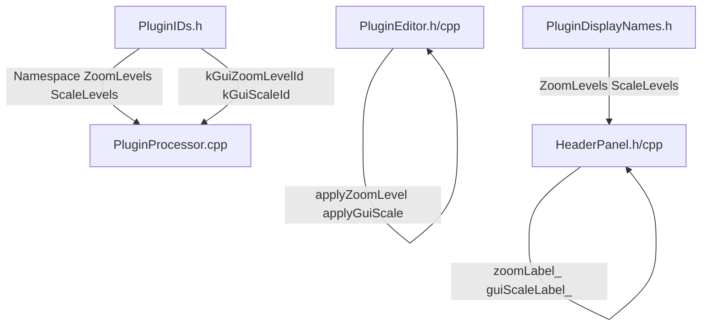

# Renommage de "Zoom" vers "Scale" dans la codebase

## Contexte

Le terme "Zoom" est trompeur car il évoque l'idée de zoomer pour voir des détails (comme Photoshop), alors que dans les plugins audio, on redimensionne l'interface entière. Le terme "Scale" est le standard de l'industrie (Serum, Fabfilter, Massive X, etc.).

## Objectifs

1. Remplacer toute mention de "Zoom" par "Scale" dans le code
2. Conserver le label combobox "GUI :" (avec espace) au lieu de "ZOOM :"
3. Maintenir la compatibilité avec les états APVTS existants (migration des anciennes propriétés)

## Architecture des changements




## Fichiers à modifier

### 1. Définitions des constantes

#### [Source/Shared/Definitions/PluginIDs.h](Source/Shared/Definitions/PluginIDs.h)

- Renommer le namespace `ZoomLevels` en `ScaleLevels`
- Renommer `kGuiZoomLevelId` en `kGuiScaleId`
- Garder les constantes `k50`, `k75`, etc. (pas de changement)
- Renommer `kFactors` en `kScaleFactors`
- Renommer la fonction `getZoomLevel()` en `getScaleFactor()`

#### [Source/Shared/Definitions/PluginDisplayNames.h](Source/Shared/Definitions/PluginDisplayNames.h)

- Renommer le namespace `ZoomLevels` en `ScaleLevels`
- Conserver les valeurs `"50%"`, `"75%"`, etc. (pas de changement)

### 2. Persistance de l'état

#### [Source/Core/PluginProcessor.cpp](Source/Core/PluginProcessor.cpp)

- Dans `initializeMidiPortProperties()` :
  - Ajouter migration depuis l'ancienne propriété `"guiZoomLevelId"` vers la nouvelle `"guiScaleId"`
  - Si `"guiZoomLevelId"` existe, copier sa valeur vers `"guiScaleId"` puis supprimer l'ancienne propriété
  - Initialiser `"guiScaleId"` avec `PluginIDs::Settings::ScaleLevels::kDefault` si elle n'existe pas

### 3. Interface utilisateur

#### [Source/GUI/PluginEditor.h](Source/GUI/PluginEditor.h)

- Renommer la méthode `applyZoomLevel(float scale)` en `applyGuiScale(float scaleFactor)`

#### [Source/GUI/PluginEditor.cpp](Source/GUI/PluginEditor.cpp)

- Dans le constructeur :
  - Utiliser `PluginIDs::Settings::kGuiScaleId` au lieu de `kGuiZoomLevelId`
  - Appeler `applyGuiScale()` au lieu de `applyZoomLevel()`
  - Utiliser `PluginIDs::Settings::ScaleLevels::getScaleFactor()` au lieu de `getZoomLevel()`
- Dans le callback `getZoomComboBox().onChange` :
  - Utiliser `kGuiScaleId` pour la propriété APVTS
  - Utiliser `getScaleFactor()` pour récupérer la valeur
- Renommer l'implémentation de `applyZoomLevel()` en `applyGuiScale()`
- Supprimer les lignes `setBufferedToImage(false)` (ajoutées lors du test de l'option 1)

#### [Source/GUI/Panels/MainComponent/HeaderPanel/HeaderPanel.h](Source/GUI/Panels/MainComponent/HeaderPanel/HeaderPanel.h)

- Renommer `zoomLabel_` en `guiScaleLabel_`
- Renommer `zoomComboBox_` en `guiScaleComboBox_`
- Renommer `kZoomLabelWidth_` en `kGuiScaleLabelWidth_`
- Renommer le getter `getZoomComboBox()` en `getGuiScaleComboBox()`

#### [Source/GUI/Panels/MainComponent/HeaderPanel/HeaderPanel.cpp](Source/GUI/Panels/MainComponent/HeaderPanel/HeaderPanel.cpp)

- Renommer toutes les variables membres selon le header
- Modifier le texte du label de `"ZOOM :"` vers `"GUI :"` (avec espace)
- Utiliser `PluginDisplayNames::ChoiceLists::ScaleLevels::k50`, etc.
- Utiliser `PluginIDs::Settings::ScaleLevels::k50`, etc.
- Ajuster `kGuiScaleLabelWidth_` de 35 à 25 (car "GUI :" est plus court que "ZOOM :")

### 4. Documentation

#### [Documentation/Development/GUI/GUI-Implementation-Details.md](Documentation/Development/GUI/GUI-Implementation-Details.md)

- Remplacer toutes les mentions de "zoom" par "scale" (sauf si contexte différent)
- Mettre à jour les explications techniques pour refléter la nouvelle terminologie

## Migration de l'état utilisateur

Le code doit gérer la migration transparente pour les utilisateurs existants :

```cpp
// Dans PluginProcessor::initializeMidiPortProperties()
if (apvts.state.hasProperty("guiZoomLevelId"))
{
    const auto oldValue = apvts.state.getProperty("guiZoomLevelId");
    apvts.state.setProperty(PluginIDs::Settings::kGuiScaleId, oldValue, nullptr);
    apvts.state.removeProperty("guiZoomLevelId", nullptr);
}

if (!apvts.state.hasProperty(PluginIDs::Settings::kGuiScaleId))
{
    apvts.state.setProperty(PluginIDs::Settings::kGuiScaleId,
                            PluginIDs::Settings::ScaleLevels::kDefault,
                            nullptr);
}
```

## Tests à effectuer après implémentation

1. Compilation sans erreurs ni warnings
2. Vérifier ReadLints (aucune erreur de linter)
3. Lancement du plugin standalone :
  - Vérifier que le label affiche "GUI :" (avec espace)
  - Changer le scale à 150%
  - Fermer et relancer : vérifier que 150% est bien restauré
4. Si un ancien state avec `"guiZoomLevelId"` est chargé, vérifier que la migration fonctionne

## Ordre d'exécution

1. Modifier `PluginIDs.h` (définitions des constantes)
2. Modifier `PluginDisplayNames.h` (display names)
3. Modifier `PluginProcessor.cpp` (migration de l'état)
4. Modifier `HeaderPanel.h` et `.cpp` (widgets UI)
5. Modifier `PluginEditor.h` et `.cpp` (orchestration)
6. Mettre à jour la documentation
7. Compiler et tester
8. Commit avec message descriptif

## Commit

Après validation, commit sur la branche `main` :

```
Rename GUI zoom terminology to scale

- Rename namespace ZoomLevels to ScaleLevels
- Rename kGuiZoomLevelId to kGuiScaleId
- Rename applyZoomLevel() to applyGuiScale()
- Update HeaderPanel: zoomComboBox_ to guiScaleComboBox_
- Change label from "ZOOM :" to "GUI :" (industry standard)
- Add migration from old guiZoomLevelId property
- Update documentation to reflect new terminology
```

