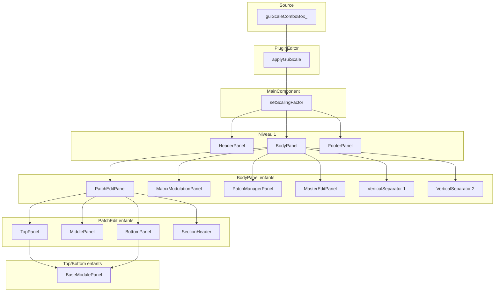

# Plan : propagation du scaling factor dans toute la GUI

## État actuel (déjà en place)

- **Source du scale** : [PluginEditor.cpp](Source/GUI/PluginEditor.cpp) — `guiScaleComboBox_.onChange` appelle `applyGuiScale(scaleFactor)` et persiste l’ID dans l’APVTS ; au chargement, le scale sauvegardé est appliqué et la ComboBox est synchronisée.
- **Application** : `applyGuiScale()` redimensionne la fenêtre et appelle `mainComponent->setScalingFactor(scaleFactor)`.
- **Propagation niveau 1** : [MainComponent::setScalingFactor](Source/GUI/MainComponent.cpp) met à jour `scalingFactor_`, appelle `setScalingFactor` sur HeaderPanel, BodyPanel, FooterPanel, puis `resized()` et `repaint()`.
- **HeaderPanel** : reçoit le scale, l’utilise dans `resized()` pour le layout de ses widgets et leur passe `setScalingFactor`. OK.
- **Widgets déjà scalables** : Button, Label, ComboBox, Slider, HorizontalSeparator ; ParameterPanel, ModuleHeaderPanel, ModulationBusPanel ; panels PatchManager (BankUtility, InternalPatches, ComputerPatches, PatchMutator), MatrixModulationPanel (buses + init button), MasterEditPanel (sans propagation vers enfants).

## Manques identifiés

1. **BodyPanel** : ne propage pas le scale aux **VerticalSeparator** ; **resized()** n’utilise pas `scalingFactor_` (positions et tailles en pixels de base).
2. **PatchEditPanel** : ne propage pas le scale à **sectionHeader_**, **topPanel_**, **middlePanel_**, **bottomPanel_** ; **resized()** n’utilise pas `scalingFactor`_.
3. **TopPanel, MiddlePanel, BottomPanel** : n’ont pas `setScalingFactor` ni `scalingFactor`_ ; pas de propagation aux panels enfants ; **resized()** en pixels fixes.
4. **BaseModulePanel** : pas de `setScalingFactor` ; ne propage pas à **moduleHeaderPanel_** ni **parameterPanels_** ; **resized()** utilise `getHeight()` / `getTotalHeight()` sans les multiplier par le scale.
5. **MasterEditPanel** : ne propage pas le scale à **sectionHeader_**, **midiPanel_**, **vibratoPanel_**, **miscPanel_** ; **resized()** n’utilise pas `scalingFactor`_.
6. **MatrixModulationPanel** : ne propage pas à **sectionHeader_** ni **modulationBusHeader_** ; **resized()** utilise des dimensions brutes (getHeight(), constantes PluginDimensions) sans scale.
7. **PatchManagerPanel** : **resized()** n’utilise pas `scalingFactor`_ (sectionHeaderHeight, hauteurs des sous-panels).
8. **Widgets sans scale** : **VerticalSeparator**, **SectionHeader**, **ModulationBusHeader** — pas de `scalingFactor_` ni `setScalingFactor`, donc pas de dessin scalé.
9. **Widgets du MiddlePanel** : **EnvelopeDisplay**, **TrackGeneratorDisplay**, **ModuleHeader**, **PatchNameDisplay** — pas de scaling ; ils doivent subir les mêmes adaptations que le reste de la GUI pour réagir au scaling factor.
10. **FooterPanel** : **paint()** n’utilise pas `scalingFactor_` (kPadding_, kIconSize_, police).

## Principes (alignés sur le document de passation)

- Chaque composant qui dessine ou qui participe au layout possède `float scalingFactor_ = 1.0f` et `void setScalingFactor(float)` avec garde `juce::approximatelyEqual` + `repaint()` (et propagation aux enfants pour les panels).
- **Layout** : dimensions dérivées = `juce::roundToInt(static_cast<float>(baseValue) * scalingFactor_)` (un seul arrondi en fin).
- **Dessin** : bounds en `Rectangle<float>`, épaisseurs/tailles en `... * scalingFactor`_, avec `std::max(1.0f, ...)` pour les traits pour éviter 0 à 50 %.

---

## 1. Widgets : ajouter scaling et dessin scalé

### 1.1 VerticalSeparator

- Fichiers : [VerticalSeparator.h](Source/GUI/Widgets/VerticalSeparator.h), `.cpp`.
- Ajouter `float scalingFactor_ = 1.0f`, `void setScalingFactor(float)` (garde + `repaint()`).
- Dans `paint()` : utiliser `scalingFactor`_ pour ligne (épaisseur avec `std::max(1.0f, ...)`), paddings.
- Pour le layout parent : soit exposer `getBaseWidth()` / `getBaseHeight()` (valeurs actuelles `width_` / `height_`), soit garder `getWidth()`/`getHeight()` comme dimensions de base et le parent calcule `roundToInt(base * scalingFactor_)` pour les bounds. Si le parent utilise déjà `getWidth()`/`getHeight()` pour positionner, BodyPanel devra calculer les bounds scalés et appeler `setBounds` avec ces valeurs (et passer le scale au séparateur).

### 1.2 SectionHeader

- Fichiers : [SectionHeader.h](Source/GUI/Widgets/SectionHeader.h), `.cpp`.
- Ajouter `float scalingFactor_ = 1.0f`, `void setScalingFactor(float)` (garde + `repaint()`).
- Dans `paint()` (et helpers) : bounds en float, `kContentHeight_`, `kLineHeight_`, `kLeftLineWidth_`, `kTextSpacing_`, police, etc. multipliés par `scalingFactor_`, un seul arrondi si besoin pour des API int.
- Garder `getWidth()` / `getHeight()` comme dimensions de base (pour que les parents fassent `roundToInt(getWidth() * scalingFactor_)` dans leur layout).

### 1.3 ModulationBusHeader

- Même principe : ajouter `scalingFactor_`, `setScalingFactor`, et appliquer le scale dans `paint()` (et éventuellement dans les dimensions exposées pour le layout).

---

## 2. BodyPanel : layout scalé et propagation aux séparateurs

- Dans [BodyPanel.cpp](Source/GUI/Panels/MainComponent/BodyPanel/BodyPanel.cpp) :
  - Dans `setScalingFactor` : appeler `verticalSeparator1_->setScalingFactor(scalingFactor_)` et `verticalSeparator2_->setScalingFactor(scalingFactor_)`.
  - Dans `resized()` : calculer toutes les dimensions et positions avec `scalingFactor_` :
    - `padding_`, `patchEditPanelWidth_`/`Height_`, `matrixModulationPanelWidth_`/`Height_`, etc. → `roundToInt(static_cast<float>(base) * scalingFactor_)`.
    - Largeur/hauteur des séparateurs : utiliser les dimensions de base des VerticalSeparator (ex. `PluginDimensions::Widgets::Widths::VerticalSeparator::kStandard`) × `scalingFactor_` pour les bounds.
  - Un seul arrondi par dimension (pas d’arrondis intermédiaires qui désalignent).

---

## 3. PatchEditPanel : propagation et layout scalé

- Dans [PatchEditPanel.cpp](Source/GUI/Panels/MainComponent/BodyPanel/PatchEditPanel/PatchEditPanel.cpp) :
  - Dans `setScalingFactor` : propager à `sectionHeader_`, `topPanel_`, `middlePanel_`, `bottomPanel_` (après avoir ajouté `setScalingFactor` à ces trois panels).
  - Dans `resized()` : utiliser `scalingFactor_` pour toutes les hauteurs et largeurs (sectionHeaderHeight, topPanelHeight_, middlePanelHeight_, bottomPanelHeight_) : `roundToInt(static_cast<float>(base) * scalingFactor_)`.

---

## 4. TopPanel, MiddlePanel, BottomPanel : setScalingFactor + layout scalé

### 4.1 TopPanel

- [TopPanel.h](Source/GUI/Panels/MainComponent/BodyPanel/PatchEditPanel/TopPanel/TopPanel.h) / `.cpp` : ajouter `float scalingFactor_ = 1.0f`, `void setScalingFactor(float)`.
  - Dans `setScalingFactor` : propager à `dco1Panel`*, `dco2Panel`*, `vcfVcaPanel_`, `fmTrackPanel_`, `rampPortamentoPanel_` (tous des BaseModulePanel).
  - Dans `resized()` : `childModuleWidth_`, `childModuleHeight_`, `spacing_` multipliés par `scalingFactor_`, puis `roundToInt` pour les bounds.

### 4.2 BottomPanel

- [BottomPanel.h](Source/GUI/Panels/MainComponent/BodyPanel/PatchEditPanel/BottomPanel/BottomPanel.h) / `.cpp` : idem — `scalingFactor_`, `setScalingFactor`, propagation aux cinq panels Env/Lfo, layout en dimensions scalées.

### 4.3 MiddlePanel

- [MiddlePanel.h](Source/GUI/Panels/MainComponent/BodyPanel/PatchEditPanel/MiddlePanel/MiddlePanel.h) / `.cpp` : ajouter `scalingFactor_`, `setScalingFactor`.
  - Propager à tous les enfants : `envelope1Display_`, `envelope2Display_`, `envelope3Display_`, `trackGeneratorDisplay_`, `patchNameModuleHeader_`, `patchNameDisplay_`. Ces widgets doivent au préalable recevoir la même logique de scaling que le reste de la GUI (voir section 10).
  - Dans `resized()` : toutes les dimensions (childWidth, childHeight, kSpacing, moduleHeaderHeight, kPatchNameSectionPaddingTop, kPatchNameSectionSpacing) calculées avec `scalingFactor_` et un seul `roundToInt` en fin.

---

## 5. BaseModulePanel : setScalingFactor et layout scalé

- [BaseModulePanel.h](Source/GUI/Panels/Reusable/BaseModulePanel.h) : ajouter `float scalingFactor_ = 1.0f`, `void setScalingFactor(float scalingFactor)`.
- [BaseModulePanel.cpp](Source/GUI/Panels/Reusable/BaseModulePanel.cpp) :
  - Dans `setScalingFactor` : propager à `moduleHeaderPanel_` et à chaque élément de `parameterPanels_`.
  - Dans `resized()` : utiliser `scalingFactor_` pour les hauteurs :
    - `header->getHeight()` → `juce::roundToInt(static_cast<float>(ModuleHeaderPanel::getHeight()) * scalingFactor_)` (ou équivalent depuis l’instance si besoin).
    - `paramPanel->getTotalHeight()` → `juce::roundToInt(static_cast<float>(paramPanel->getTotalHeight()) * scalingFactor_)`.
  - Déduire les bounds des enfants avec ces hauteurs scalées (sans modifier les getHeight/getTotalHeight des sous-composants pour qu’ils continuent à exposer des dimensions de base).

---

## 6. MasterEditPanel : propagation et layout scalé

- [MasterEditPanel.cpp](Source/GUI/Panels/MainComponent/BodyPanel/MasterEditPanel/MasterEditPanel.cpp) :
  - Dans `setScalingFactor` : propager à `sectionHeader_`, `midiPanel_`, `vibratoPanel_`, `miscPanel_`.
  - Dans `resized()` : sectionHeaderHeight, childModuleWidth_, midiPanelHeight_, vibratoPanelHeight_, miscPanelHeight_ tous calculés avec `scalingFactor`_ et `roundToInt`.

---

## 7. MatrixModulationPanel : propagation et layout scalé

- [MatrixModulationPanel.cpp](Source/GUI/Panels/MainComponent/BodyPanel/MatrixModulationPanel/MatrixModulationPanel.cpp) :
  - Dans `setScalingFactor` : appeler `sectionHeader_->setScalingFactor(scalingFactor_)` et `modulationBusHeader_->setScalingFactor(scalingFactor_)`.
  - Dans `resized()` : toutes les dimensions (hauteur section header, hauteur bus header, largeur/hauteur du bouton Init, hauteur des buses) calculées avec `scalingFactor`_ ; utiliser par ex. `roundToInt(static_cast<float>(sectionHeader_->getHeight()) * scalingFactor_)` pour les bounds du header, idem pour ModulationBusHeader et pour les buses (getHeight() des buses = dimensions de base).

---

## 8. PatchManagerPanel : layout scalé

- [PatchManagerPanel.cpp](Source/GUI/Panels/MainComponent/BodyPanel/PatchManagerPanel/PatchManagerPanel.cpp) :
  - Dans `setScalingFactor` : propager aussi à `sectionHeader`_ (déjà fait pour les 4 sous-panels).
  - Dans `resized()` et dans les helpers de layout : sectionHeaderHeight, bankUtilityPanelHeight_, internalPatchesPanelHeight_, computerPatchesPanelHeight_, patchMutatorPanelHeight_ calculés avec `scalingFactor`_ et `roundToInt` ; utiliser ces valeurs pour les setBounds.

---

## 9. FooterPanel : paint scalé

- [FooterPanel.cpp](Source/GUI/Panels/MainComponent/FooterPanel/FooterPanel.cpp) :
  - Dans `paint()` : utiliser `scalingFactor`_ pour `kPadding`*, `kIconSize*`, et la taille de la police (ex. `skin_->getBaseFont()` avec hauteur × `scalingFactor`_).
  - Inset / bounds du texte : dimensions dérivées avec `roundToInt(... * scalingFactor_)`, avec minimum 1 si besoin pour les espacements.

---

## 10. Composants du MiddlePanel : rendre scalables (obligatoire)

Les composants du MiddlePanel doivent subir les **mêmes adaptations** que le reste de la GUI : ils doivent devenir parfaitement scalables et réagir au scaling factor ajusté par l’utilisateur, en suivant la logique déjà en place dans la codebase.

### 10.1 Widgets concernés

- **EnvelopeDisplay** (×3 dans MiddlePanel) — fichiers : `Source/GUI/Widgets/EnvelopeDisplay.h`, `.cpp`
- **TrackGeneratorDisplay** — fichiers : `Source/GUI/Widgets/TrackGeneratorDisplay.h`, `.cpp`
- **ModuleHeader** (patch name) — fichiers : `Source/GUI/Widgets/ModuleHeader.h`, `.cpp`
- **PatchNameDisplay** — fichiers : `Source/GUI/Widgets/PatchNameDisplay.h`, `.cpp`

### 10.2 Modifications à appliquer à chaque widget

- Ajouter `float scalingFactor_ = 1.0f` et `void setScalingFactor(float)` avec garde `juce::approximatelyEqual` + `repaint()`.
- Dans `paint()` : bounds en `juce::Rectangle<float>`, toutes les dimensions logiques (épaisseurs, paddings, tailles de police, etc.) multipliées par `scalingFactor`_ ; `std::max(1.0f, ...)` pour les traits pour éviter 0 à 50 %.
- Exposer des dimensions de base pour le layout parent : `getWidth()` / `getHeight()` (ou `getBaseWidth()` / `getBaseHeight()`) restent en pixels logiques de base ; le MiddlePanel calcule les bounds avec `roundToInt(base * scalingFactor_)` dans son `resized()`.
- Un seul arrondi en dernière opération quand une API exige des `int`.

Une fois ces quatre types de widgets adaptés, le MiddlePanel pourra leur passer `setScalingFactor` et utiliser le scale dans son layout comme décrit en section 4.3.

---

## Ordre de mise en œuvre recommandé

1. **Widgets** : VerticalSeparator, SectionHeader, ModulationBusHeader (scale + dessin).
2. **Widgets MiddlePanel** : EnvelopeDisplay, TrackGeneratorDisplay, ModuleHeader, PatchNameDisplay (scale + dessin, mêmes principes que le reste de la GUI).
3. **BodyPanel** : propagation aux VerticalSeparators + resized() scalé.
4. **BaseModulePanel** : setScalingFactor + propagation + resized() scalé (pour que tous les modules Dco/Env/Lfo/Midi/Vibrato/Misc en bénéficient dès que leurs parents propagent).
5. **TopPanel, BottomPanel** : setScalingFactor + propagation + resized() scalé.
6. **PatchEditPanel** : propagation + resized() scalé.
7. **MiddlePanel** : setScalingFactor + propagation vers les six composants (envelope 1–3, trackGenerator, patchNameModuleHeader, patchNameDisplay) + resized() scalé.
8. **MasterEditPanel** : propagation + resized() scalé.
9. **MatrixModulationPanel** : propagation (sectionHeader_, modulationBusHeader_) + resized() scalé.
10. **PatchManagerPanel** : propagation sectionHeader_ + resized() scalé.
11. **FooterPanel** : paint() scalé.

---

## Schéma de propagation (résumé)

Ce plan applique le scaling factor ajustable par l’utilisateur (ComboBox du HeaderPanel) à toute la hiérarchie GUI, en respectant les patterns du document de passation (dimensions de base × scale, un seul arrondi, propagation explicite, pas de cache).