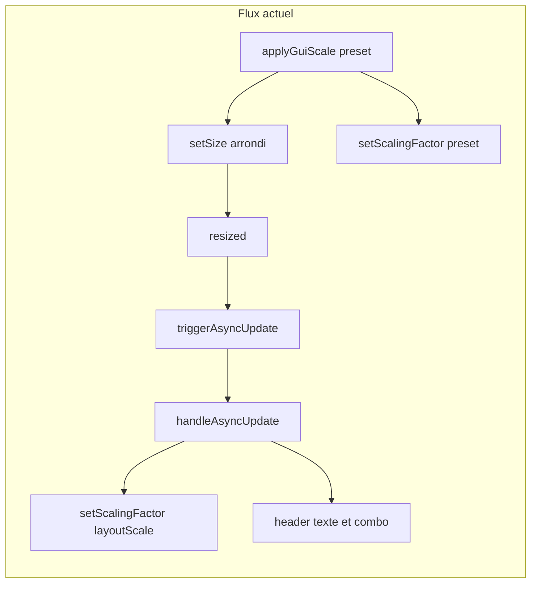
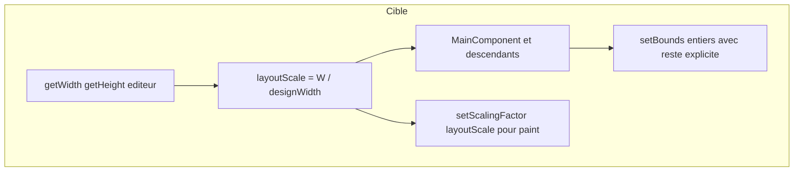

# Plan de refactorisation GUI Matrix-Control (échelle, layout, clipping)

## Contexte et objectifs

- **Problème observé** : décalages de plusieurs pixels et clipping (lignes décoratives) liés surtout à **sommes d’arrondis** sur plusieurs niveaux de `Component`, pas à un défaut isolé du moteur graphique.
- **Objectif** : codebase **cohérente** (une règle claire pour l’échelle de layout), **rendu stable** (invariants de somme + reste explicite là où il manque), **code propre** (helpers réutilisables, méthodes courtes, noms explicites), **perf** : conserver les garde-fous existants (`approximatelyEqual`, pas de réintroduction de caches inutiles).

Référence utile côté JUCE : [Parent and child components](https://juce.com/tutorials/tutorial_component_parents_children/) (clip aux bounds, traits au bord).

## État actuel (points d’attention dans le code)

- [`PluginEditor.cpp`](/Volumes/Guillaume/Dev/SDKs/JUCE/Projects/Matrix-Control/Source/GUI/PluginEditor.cpp) : **deux sources** pour `setScalingFactor` — `applyGuiScale(scaleFactor)` (preset) puis `handleAsyncUpdate()` avec `layoutScale = getWidth() / baseWidth`. Après `setSize(round(base * preset))`, **`layoutScale` ≠ facteur preset** en général → micro-incohérence propagée à toute la hiérarchie.
- [`MainComponent.cpp`](/Volumes/Guillaume/Dev/SDKs/JUCE/Projects/Matrix-Control/Source/GUI/MainComponent.cpp) : **footer en hauteur restante** — bon pattern à **généraliser** là où il manque.
- [`BodyPanel.cpp`](/Volumes/Guillaume/Dev/SDKs/JUCE/Projects/Matrix-Control/Source/GUI/Panels/MainComponent/BodyPanel/BodyPanel.cpp) : effort documenté sur les **X en float** ; zone fragile : `patchManagerH = contentHeight - matrixH` (**soustraction** sans reste explicite vers un bloc « flexible »).
- [`BaseModulePanel.cpp`](/Volumes/Guillaume/Dev/SDKs/JUCE/Projects/Matrix-Control/Source/GUI/Panels/Reusable/BaseModulePanel.cpp) : **dernier `ParameterPanel` = bounds restants** — à conserver ; harmoniser avec hauteur de ligne calculée.
- [`ParameterPanel.cpp`](/Volumes/Guillaume/Dev/SDKs/JUCE/Projects/Matrix-Control/Source/GUI/Panels/Reusable/ParameterPanel.cpp) : nombreux `roundToInt` indépendants (label / widget / séparateur) ; risque de **désalignement interne** vs hauteur « théorique » utilisée au niveau parent.
- [`HorizontalSeparator.cpp`](/Volumes/Guillaume/Dev/SDKs/JUCE/Projects/Matrix-Control/Source/GUI/Widgets/HorizontalSeparator.cpp) : ligne centrée + épaisseur ; si hauteur du composant **trop petite** après arrondi → **clip / disparition** (symptôme utilisateur).
- [`PluginEditor.h`](/Volumes/Guillaume/Dev/SDKs/JUCE/Projects/Matrix-Control/Source/GUI/PluginEditor.h) : méthodes statiques `getWidth()` / `getHeight()` qui masquent la sémantique **design vs réel** — dette de lisibilité et risque d’erreur.

**Fichiers avec beaucoup de `roundToInt` (à traiter par vague)** : `InternalPatchesPanel.cpp`, `PatchMutatorPanel.cpp`, `ComputerPatchesPanel.cpp`, `ModulationBusPanel.cpp`, `MiddlePanel.cpp`, etc. (repérage déjà fait par grep).

## Principe cible (contrat d’échelle)

- **`layoutScale`** : **unique** facteur dérivé des **pixels réels** de l’`AudioProcessorEditor` (largeur / `PluginDimensions::GUI::kWidth`, cohérent avec ratio fixe hauteur/largeur).
- **`applyGuiScale(preset)`** : ne fait que **`setSize`** (borné par `setResizeLimits` / constrainer) ; **ne** passe **plus** un facteur « logique preset » à `setScalingFactor` si celui-ci est immédiatement écrasé ou divergent.
- **`hostScale`** (`getTransform().mat00`) : **documenter** le choix produit — par défaut recommandé : **affichage** (pourcentage utilisateur) **optionnel** ; **layout** = `layoutScale` basé sur taille fenêtre (évite double application implicite). Si un jour tu veux absorber le zoom hôte dans le layout, ce sera un **changement explicite** et testé.

## Livrables transverses (petits modules)

Créer un module **minimal** (ex. [`GUI/Layout/ScaledLayout.h`](/Volumes/Guillaume/Dev/SDKs/JUCE/Projects/Matrix-Control/Source/GUI/Layout/ScaledLayout.h) + `.cpp` si besoin) avec responsabilités **SRP** :

- **`layoutScaleFromEditorBounds(editorW, designW)`** → `float` (garde division par zéro).
- **`scaledInt(float designPx, float layoutScale)`** : une convention unique (ex. `roundToInt` documentée, ou `truncate` — **une seule** pour le projet après décision).
- **`distributeHeights(totalHeight, spansDesign[], layoutScale)`** → `std::vector<int>` dont **la somme == totalHeight** (dernier span ou span marqué « flexible » absorbe le reste).
- **`distributeWidths`** analogue pour zones multi-colonnes si réutilisable.

Contraintes **Clean** : fonctions courtes, pas de magic numbers (réutiliser `PluginDimensions`), tests manuels documentés (liste de presets à vérifier).

Intégration **CMake** : ajouter les nouveaux `.cpp` dans la liste des sources du target plugin Matrix-Control (fichier CMake du projet à localiser et mettre à jour).

**Validation Guillaume (après ajout des helpers `GUI/Layout` seuls, si livré avant une vague UI)**

- **Build** du projet : succès.
- Lancer le plugin : **smoke** (fenêtre s’ouvre, pas de crash). Aucun changement visuel n’est attendu tant que les panneaux n’appellent pas encore les helpers ; si un branchement partiel est livré, appliquer la checklist de la vague concernée en plus.

## Vagues de mise en œuvre (avec tes validations écran)

Chaque vague : **build** (preset CMake du projet), **smoke** standalone ou DAW, **captures** sur quelques facteurs (50 %, 90 %, 100 %, 125 %, 200 %) + un **redimensionnement libre** si applicable.

**Convention** : à chaque fois que l’agent annonce une vague **terminée**, tu enchaînes avec la checklist **« Validation Guillaume »** de cette vague avant de valider la suite. Tu peux noter « OK vague N » ou lister les anomalies pour correction.

### Vague 0 — Baseline et non-régression perf

- Noter le comportement actuel (optionnel : 2–3 captures de référence).
- Vérifier qu’aucune passe ne réintroduit de **listeners lourds** ou de **repaint** global inutile ; conserver `approximatelyEqual` sur `setScalingFactor`.

**Validation Guillaume (après vague 0)**

- Ouvrir Matrix-Control **standalone** (ou AU/VST3 dans un DAW que tu utilises d’habitude pour ce plugin).
- Sans changer le code : faire **2–3 captures d’écran** à des facteurs différents (ex. 100 %, 75 %, 200 %) comme **référence avant** (dossier ou nom de fichier daté).
- Faire un **smoke** rapide : changer d’onglet / mode si applicable, bouger un slider, ouvrir/fermer une combo — rien ne doit crasher.
- Optionnel : noter subjectivement la fluidité (scroll, resize) pour comparer après les vagues suivantes.

### Vague 1 — PluginEditor : source unique + header

Fichiers : [`PluginEditor.cpp`](/Volumes/Guillaume/Dev/SDKs/JUCE/Projects/Matrix-Control/Source/GUI/PluginEditor.cpp), [`PluginEditor.h`](/Volumes/Guillaume/Dev/SDKs/JUCE/Projects/Matrix-Control/Source/GUI/PluginEditor.h), éventuellement [`HeaderPanel.cpp`](/Volumes/Guillaume/Dev/SDKs/JUCE/Projects/Matrix-Control/Source/GUI/Panels/MainComponent/HeaderPanel/HeaderPanel.cpp).

- Unifier : **`setScalingFactor(layoutScale)`** dérivé **uniquement** de `getWidth()` / design (appel depuis `resized()` et/ou `handleAsyncUpdate()`, **sans** double valeur preset).
- `applyGuiScale` : **`setSize` seulement** puis laisser `resized` propager (ou appeler explicitement une méthode `syncLayoutScaleFromEditor()` **une** fois).
- Renommer les statiques **`getWidth()` / `getHeight()`** en **`getDesignWidth()` / `getDesignHeight()`** (ou équivalent) et corriger les call sites pour éviter toute confusion avec `Component::getWidth()`.
- Header : aligner l’affichage `%` (`effectiveScale` vs `layoutScale`) avec la **même définition** que le facteur réellement utilisé pour le layout ; conserver `setGuiScaleDisplayText` / `setCustomDisplayText` pour le mode « resize libre » si tu le souhaites (même logique que ton projet Test-ScalableUI).

**`AsyncUpdater` / `handleAsyncUpdate` (point explicite à trancher dans cette vague)** :

- Ce n’est **pas** du « async » au sens thread / I/O : tout reste sur le **message thread** JUCE.
- Rôle probable à l’origine : **reporter** le travail après le retour de `resized()` et/ou **coalescer** plusieurs `triggerAsyncUpdate()` pendant un drag de redimensionnement (moins d’appels répétés à `setScalingFactor` + mise à jour header/combo).
- Ce mécanisme **ne corrige pas** à lui seul l’incohérence preset vs `layoutScale` ; il ne fait que décaler / fusionner des mises à jour.
- **Décision à prendre** après la mise en place du facteur unique : (a) **conserver** `AsyncUpdater` uniquement si la coalescence apporte un gain mesurable ou évite un cas limite ; (b) **simplifier** en appel synchrone en fin de `resized()` (ex. `syncLayoutScaleFromEditor()` une fois `setBounds` fait) si aucun problème de réentrance ni coût notable — pour réduire la complexité mentale.

**Critère de done vague 1** : pas de « saut » de layout au moment du preset ; combo / % cohérents avec la grille interne ; décision Async vs sync **documentée** (commentaire court ou note dans le plan d’archi).

**Validation Guillaume (après vague 1)**

- Build + lancer le plugin (standalone **et** au moins **un** format hôte : AU ou VST3).
- **Combo GUI scale** : parcourir **tous** les presets (50 % → 400 %) ; vérifier absence de **saut** ou clignotement bizarre du layout ; le **% affiché** dans le header doit être **cohérent** avec ce que vous avez défini (layout vs effectif + hôte).
- **Resize** : tirer le coin redimensionnable ; le texte / combo doit suivre (si comportement type Test-ScalableUI) ; pas de désync évidente combo ↔ taille fenêtre.
- **Hôte avec zoom UI** (si disponible) : smoke rapide pour voir si l’affichage % reste acceptable (pas de demande de perfection, juste « pas fou »).
- Signaler tout **écart** entre preset choisi et taille réelle (pixels) si tu le vois au fer à l’œil.

### Vague 2 — MainComponent + BodyPanel

Fichiers : [`MainComponent.cpp`](/Volumes/Guillaume/Dev/SDKs/JUCE/Projects/Matrix-Control/Source/GUI/MainComponent.cpp), [`BodyPanel.cpp`](/Volumes/Guillaume/Dev/SDKs/JUCE/Projects/Matrix-Control/Source/GUI/Panels/MainComponent/BodyPanel/BodyPanel.cpp).

- **MainComponent** : formaliser l’invariant `headerH + bodyH + footerH == height` (footer déjà reste — documenter / assert debug optionnel).
- **BodyPanel** : remplacer la soustraction « patch manager = content - matrix » par une **répartition à somme garantie** (matrix + patch manager = `contentHeight`, l’un des deux absorbe le **reste** après arrondi des hauteurs design × scale). Conserver l’approche **X depuis origine float** si elle reste la plus stable, ou la migrer vers helpers du module Layout.

**Critère de done vague 2** : plus de « respiration » visible du bas de la colonne matrix / patch manager entre presets.

**Validation Guillaume (après vague 2)**

- Même grille de presets (50 %, 90 %, 100 %, 125 %, 200 % minimum).
- **Zoom visuel** sur la zone **Body** : jointures header/body/footer, **séparateurs verticaux** entre colonnes Patch Edit / Matrix / Patch Manager / Master.
- Comparer **deux presets** proches (ex. 90 % vs 100 %) : le bas des colonnes matrix / patch manager ne doit plus « respirer » ni **perdre** une bande visible.
- Optionnel : **capture** côte à côte avant/après si tu documentes la refacto.

### Vague 3 — BaseModulePanel + ParameterPanel + HorizontalSeparator

Fichiers : [`BaseModulePanel.cpp`](/Volumes/Guillaume/Dev/SDKs/JUCE/Projects/Matrix-Control/Source/GUI/Panels/Reusable/BaseModulePanel.cpp), [`ParameterPanel.cpp`](/Volumes/Guillaume/Dev/SDKs/JUCE/Projects/Matrix-Control/Source/GUI/Panels/Reusable/ParameterPanel.cpp), [`HorizontalSeparator.cpp`](/Volumes/Guillaume/Dev/SDKs/JUCE/Projects/Matrix-Control/Source/GUI/Widgets/HorizontalSeparator.cpp).

- **ParameterPanel** : soit **layout vertical par `removeFromTop`** sur un rectangle entier (une seule « vérité » de hauteur), soit garantir que **hauteur totale** == celle utilisée dans `BaseModulePanel` pour les lignes non finales.
- **HorizontalSeparator** : garantir **hauteur minimale ≥ 1** *après* échelle **ou** dessiner la ligne avec une marge intérieure pour éviter le clip au bas du parent (choix à trancher : préférence **hauteur min 1** + documenter).
- **`ParameterPanel::setScalingFactor`** : aujourd’hui `repaint()` seul — après refactor layout, s’assurer qu’un changement d’échelle déclenche bien **`resized()`** via la chaîne parente (éviter état incohérent si l’ordre d’appels change).

**Critère de done vague 3** : lignes horizontales stables ; modules Patch/Master sans décalage vertical entre lignes de paramètres.

**Validation Guillaume (après vague 3)**

- Ouvrir des vues qui utilisent **ParameterPanel** + **lignes horizontales** (modules Patch/Master dans le body).
- Sur **plusieurs presets** : vérifier que les **traits décoratifs** entre lignes de paramètres ne **disparaissent** pas et qu’il n’y a pas de **décalage** d’un pixel entre lignes adjacentes.
- Tester au moins un **module** avec beaucoup de lignes (scroll interne si présent).

### Vague 4 — PatchEditPanel (Top / Middle / Bottom)

Fichiers : [`PatchEditPanel.cpp`](/Volumes/Guillaume/Dev/SDKs/JUCE/Projects/Matrix-Control/Source/GUI/Panels/MainComponent/BodyPanel/PatchEditPanel/PatchEditPanel.cpp), [`TopPanel.cpp`](/Volumes/Guillaume/Dev/SDKs/JUCE/Projects/Matrix-Control/Source/GUI/Panels/MainComponent/BodyPanel/PatchEditPanel/TopPanel/TopPanel.cpp), [`MiddlePanel.cpp`](/Volumes/Guillaume/Dev/SDKs/JUCE/Projects/Matrix-Control/Source/GUI/Panels/MainComponent/BodyPanel/PatchEditPanel/MiddlePanel/MiddlePanel.cpp), [`BottomPanel.cpp`](/Volumes/Guillaume/Dev/SDKs/JUCE/Projects/Matrix-Control/Source/GUI/Panels/MainComponent/BodyPanel/PatchEditPanel/BottomPanel/BottomPanel.cpp).

- Appliquer le **même modèle** : sommes de hauteurs/largeurs avec **reste** sur un panneau flexible (souvent le dernier ou la zone scrollable si présente).
- `MiddlePanel` est le plus dense en `roundToInt` : prioriser **extraction** de helpers ou sous-fonctions pour respecter tes limites de taille de méthode.

**Validation Guillaume (après vague 4)**

- Passer en mode **Patch Edit** (ou équivalent) et inspecter **Top / Middle / Bottom** à plusieurs échelles.
- Vérifier **enveloppes**, **displays**, **patch name**, alignement des **sous-panneaux** (Dco, Vcf, etc.) : pas de clipping de bord, pas de saut entre presets.
- Si tu utilises des **captures** pour régression : refaire la série sur cette zone (c’est souvent la plus visible).

### Vague 5 — MatrixModulationPanel + ModulationBusPanel

Fichiers : [`MatrixModulationPanel.cpp`](/Volumes/Guillaume/Dev/SDKs/JUCE/Projects/Matrix-Control/Source/GUI/Panels/MainComponent/BodyPanel/MatrixModulationPanel/MatrixModulationPanel.cpp), [`ModulationBusPanel.cpp`](/Volumes/Guillaume/Dev/SDKs/JUCE/Projects/Matrix-Control/Source/GUI/Panels/Reusable/ModulationBusPanel.cpp).

- Même discipline de **somme** + séparateurs ; vérifier les **hauteurs de bus** et la ligne de séparation du bas.

**Validation Guillaume (après vague 5)**

- Ouvrir la section **Matrix modulation** ; défiler les **bus** si la liste est longue.
- Vérifier **séparateurs**, **combo** source/destination, **sliders** : alignement vertical entre bus, pas de ligne coupée en bas de la zone.
- Plusieurs presets + un **resize** libre : smoke rapide.

### Vague 6 — PatchManager (sous-modules lourds)

Fichiers : [`PatchManagerPanel.cpp`](/Volumes/Guillaume/Dev/SDKs/JUCE/Projects/Matrix-Control/Source/GUI/Panels/MainComponent/BodyPanel/PatchManagerPanel/PatchManagerPanel.cpp), [`InternalPatchesPanel.cpp`](/Volumes/Guillaume/Dev/SDKs/JUCE/Projects/Matrix-Control/Source/GUI/Panels/MainComponent/BodyPanel/PatchManagerPanel/Modules/InternalPatchesPanel.cpp), [`BankUtilityPanel.cpp`](/Volumes/Guillaume/Dev/SDKs/JUCE/Projects/Matrix-Control/Source/GUI/Panels/MainComponent/BodyPanel/PatchManagerPanel/Modules/BankUtilityPanel.cpp), [`ComputerPatchesPanel.cpp`](/Volumes/Guillaume/Dev/SDKs/JUCE/Projects/Matrix-Control/Source/GUI/Panels/MainComponent/BodyPanel/PatchManagerPanel/Modules/ComputerPatchesPanel.cpp), [`PatchMutatorPanel.cpp`](/Volumes/Guillaume/Dev/SDKs/JUCE/Projects/Matrix-Control/Source/GUI/Panels/MainComponent/BodyPanel/PatchManagerPanel/Modules/PatchMutatorPanel.cpp).

- Remplacer les **grilles de `roundToInt` répétées** par des helpers ou des boucles de layout là où c’est pertinent, sans changer le design fonctionnel.
- Vérifier les **GroupLabel** / **SectionHeader** en bas de zone : même logique anti-clip.

**Validation Guillaume (après vague 6)**

- Parcourir **tout** le Patch Manager : banques, patches internes, ordinateur, mutator si tu l’utilises au quotidien.
- C’est la vague la plus **dense en layout** : prendre le temps de **plusieurs presets** et d’un **resize** ; noter tout **décalage** ou **ligne** manquante par sous-panneau (pour ticket de suivi ciblé).

### Vague 7 — MasterEditPanel + FooterPanel + polish

Fichiers : [`MasterEditPanel.cpp`](/Volumes/Guillaume/Dev/SDKs/JUCE/Projects/Matrix-Control/Source/GUI/Panels/MainComponent/BodyPanel/MasterEditPanel/MasterEditPanel.cpp), [`FooterPanel.cpp`](/Volumes/Guillaume/Dev/SDKs/JUCE/Projects/Matrix-Control/Source/GUI/Panels/MainComponent/FooterPanel/FooterPanel.cpp), [`HeaderPanel.cpp`](/Volumes/Guillaume/Dev/SDKs/JUCE/Projects/Matrix-Control/Source/GUI/Panels/MainComponent/HeaderPanel/HeaderPanel.cpp) (relecture finale).

- Passage **lint / cohérence include / métadonnées** (dates de révision si modifiées selon tes règles).

**Validation Guillaume (après vague 7)**

- **Master Edit** : même grille de presets + resize ; vérifier modules MIDI / vibrato / misc.
- **Footer** : déclencher un message UI (si tu as un scénario) pour voir icône + texte à plusieurs échelles.
- **Passage global** : une dernière session « **tour complet** » de l’UI (5–10 min) — interaction normale, pas seulement regarder.
- **Perf** : ouverture du plugin, changement de preset GUI, resize — ressenti doit rester **au moins** aussi fluide qu’après tes optimisations récentes (pas de freeze, pas de lag évident).
- **Doc** : copie du plan archivée dans `Documentation/Development/Plans/2026/<mois>/` (tu peux le faire toi-même ou rappeler à l’agent).

## Documentation projet (selon tes .cursorrules)

Après validation du plan dans Cursor : **copier** le fichier plan final depuis `~/.cursor/plans/` vers  
`Documentation/Development/Plans/2026/<mois>/` avec le nommage `YYYY-MM-DD-...` en anglais (même procédure que pour tes autres plans).

## Risques et mitigation

| Risque | Mitigation |
|--------|------------|
| Régression visuelle sur un seul preset | Vagues courtes + captures sur ensemble fixe de presets |
| Changement de sémantique `%` / combo | Spécifier dans vague 1 le texte affiché vs `layoutScale` / `hostScale` |
| Fichiers `resized()` très longs | Extraire helpers privés ou fonctions anonymes dans `.cpp` (toujours < 15 lignes par fonction) |
| Perf | Pas de nouveaux timers ; conserver `approximatelyEqual` ; éviter `repaint` en cascade inutile |

## Ce que ce plan ne fait pas (hors scope sauf demande)

- Refonte **LookAndFeel** globale ou migration **FlexBox** partout (possible en phase ultérieure si tu veux pousser encore la robustesse).
- Tests automatisés pixel-perfect (coûteux) ; on reste sur **validation visuelle** pilotée par toi.
