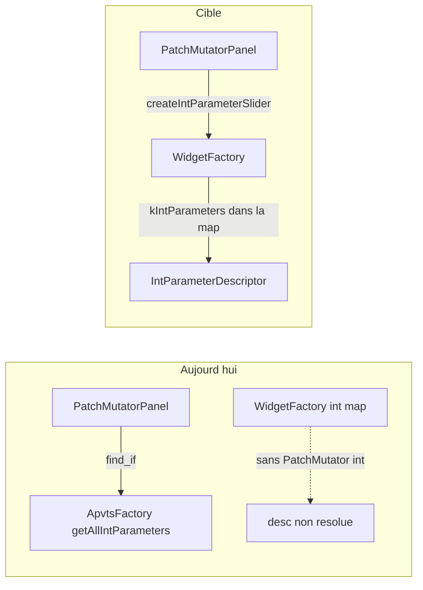

# Refactor PatchMutatorPanel — homogénéité widgets

## Contexte et problème

- [PatchMutatorPanel.cpp](Source/GUI/Panels/MainComponent/BodyPanel/SharedPanel/PatchManagerPanel/Modules/PatchMutatorPanel.cpp) construit encore **manuellement** les sliders Amount/Random (`std::make_unique<tss::Slider>` + `ApvtsFactory::getAllIntParameters()` + `find_if`) et les toggles (`Toggle` + `PluginDisplayNames` en dur), alors que les boutons passent déjà par [`createStandaloneButton`](Source/GUI/Factories/WidgetFactory.cpp).
- Les descripteurs [`PatchMutatorModule::kIntParameters`](Source/Shared/Definitions/PluginDescriptorsPatchManager.cpp) existent, mais **`WidgetFactory::buildIntParameterMap()`** n’ajoute **aucun** int du Patch Manager : seuls Patch Edit, Matrix Modulation et Master Edit sont indexés ([`buildIntParameterMap`](Source/GUI/Factories/WidgetFactory.cpp)). Même chose côté [`ApvtsFactory::getAllIntParameters()`](Source/Core/Factories/ApvtsFactory.cpp) : Patch Mutator n’y figure pas. Résultat : le lookup manuel dans le panel est fragile et ne reflète pas la source unique de vérité.
- Les entrées « toggles » du Patch Mutator sont décrites comme [`StandaloneWidgetType::kButton`](Source/Shared/Definitions/PluginDescriptorsPatchManager.cpp) avec `buttonWidth = kInit`, alors que l’UI utilise des **`tss::Toggle`** — incohérence de modèle de données vs widget.

## Principes de la refacto

1. **Une seule source** pour min/max/défaut des sliders : `IntParameterDescriptor` via `WidgetFactory`, comme [`createSliderFromDescriptor`](Source/GUI/Factories/WidgetFactory.cpp).
2. **Noms d’affichage** : préférer `getParameterDisplayName` / `getStandaloneWidgetDisplayName` (même esprit que les boutons dans [BankUtilityPanel.cpp](Source/GUI/Panels/MainComponent/BodyPanel/SharedPanel/PatchManagerPanel/Modules/BankUtilityPanel.cpp)), plutôt que `PluginDisplayNames` direct pour les libellés synchronisés avec les descripteurs.
3. **Toggles** : même pattern que `createStandaloneButton` — nouvelle méthode factory + type de widget explicite dans les descripteurs.
4. **History** : la combo reste **hors ChoiceParameter** (items dynamiques, pas de layout APVTS pour Patch Manager — voir commentaire dans [ApvtsLayoutBuilder.cpp](Source/Core/Factories/ApvtsLayoutBuilder.cpp)). On homogénéise seulement le **libellé** (et éventuellement le texte « empty » si tu centralises une chaîne dans les descripteurs plus tard) ; pas de `createChoiceParameterComboBox` sans modèle de données adapté.

## Étapes concrètes

### 1. Indexer les int parameters Patch Mutator dans `WidgetFactory`

- Dans [`addAllPatchManagerDescriptorsToMap()`](Source/GUI/Factories/WidgetFactory.cpp) (ou fonction dédiée appelée depuis `buildIntParameterMap`), appeler `addIntParametersToMap(PluginDescriptors::PatchManagerSection::PatchMutatorModule::kIntParameters)`.
- Vérifier qu’aucun `parameterId` ne collisionne avec les clés déjà présentes dans `intParameterMap` (Amount/Random sont propres au Patch Mutator).

### 2. (Optionnel mais cohérent) `ApvtsFactory::getAllIntParameters()`

- Ajouter `PatchMutatorModule::kIntParameters` à la liste agrégée **si** d’autres outils/tests s’attendent à une liste exhaustive des descripteurs int du projet. Ce n’est **pas** pour enregistrer des paramètres APVTS (Patch Manager reste en `ValueTree` properties). Si rien ne consomme cette liste pour Patch Mutator, tu peux **omettre** cette étape pour limiter le diff.

### 3. Étendre le modèle `StandaloneWidgetDescriptor` pour les toggles

- Dans [PluginDescriptors.h](Source/Shared/Definitions/PluginDescriptors.h) : ajouter `kToggle` à `enum class StandaloneWidgetType`.
- Ajouter un champ optionnel de largeur, par ex. `std::optional<int> toggleWidth` (miroir de `buttonWidth`), pour que la factory connaisse la largeur sans magic numbers côté panel.
- Mettre à jour [PluginDescriptorsPatchManager.cpp](Source/Shared/Definitions/PluginDescriptorsPatchManager.cpp) : pour chaque widget Patch Mutator qui est un **vrai** toggle (Dco1…Lfo2), passer `widgetType = kToggle` et renseigner `toggleWidth = PluginDesignDimensions::Widgets::Widths::Toggle::kPatchMutator` (20 — aligné avec le layout actuel).

### 4. `WidgetFactory` + validateur

- Déclarer `createStandaloneToggle(widgetId, skin, height)` dans [WidgetFactory.h](Source/GUI/Factories/WidgetFactory.h) (forward `tss::Toggle`).
- Implémenter dans [WidgetFactory.cpp](Source/GUI/Factories/WidgetFactory.cpp) : lookup `findStandaloneWidget`, validation du type **`kToggle`**, construction `std::make_unique<tss::Toggle>(width, height, toggleLookFromSkin(skin), desc->displayName)` avec `width = desc->toggleWidth.value_or(...)` si tu définis un défaut commun.
- Dans [WidgetFactoryValidator](Source/GUI/Factories/WidgetFactoryValidator.cpp) : soit factoriser `validateWidgetType` pour accepter le type attendu, soit ajouter `validateToggleWidgetType` en miroir de la validation bouton ; compléter `getWidgetTypeString` avec le cas `kToggle` (et `default` / `jassertfalse` pour exhaustivité si besoin).

### 5. Refactor [PatchMutatorPanel.cpp](Source/GUI/Panels/MainComponent/BodyPanel/SharedPanel/PatchManagerPanel/Modules/PatchMutatorPanel.cpp)

- **Sliders** : remplacer création manuelle par  
  `widgetFactory.createIntParameterSlider(PluginIDs::…::kAmount|kRandom, skin, Widths::Slider::kPatchMutator, Heights::kSlider)` puis `setUnit(PluginDisplayNames::Units::kPercent)` et recâbler `onValueChange` → `apvts_.state.setProperty` (inchangé fonctionnellement).
- **Labels** Amount/Random : texte via `widgetFactory.getParameterDisplayName(...).value_or({})` (les deux IDs sont des int parameters dans `kIntParameters`).
- **Label** History : `getStandaloneWidgetDisplayName(kHistory)`.
- **Toggles** : remplacer les blocs répétitifs par `widgetFactory.createStandaloneToggle(...)` + `connectToggleToApvts` existant.
- Supprimer l’include [`ApvtsFactory.h`](Source/Core/Factories/ApvtsFactory.h) si plus utilisé.

### 6. Vérifications

- Build CMake cible plugin + lancer l’UI : sliders 0–100 %, toggles, historique, boutons.
- grep / compile : tous les `switch` sur `StandaloneWidgetType` mis à jour.

## Fichiers touchés (ordre logique)

| Zone | Fichiers |
|------|----------|
| Descripteurs | [PluginDescriptors.h](Source/Shared/Definitions/PluginDescriptors.h), [PluginDescriptorsPatchManager.cpp](Source/Shared/Definitions/PluginDescriptorsPatchManager.cpp) |
| Factory | [WidgetFactory.h](Source/GUI/Factories/WidgetFactory.h), [WidgetFactory.cpp](Source/GUI/Factories/WidgetFactory.cpp), [WidgetFactoryValidator.h](Source/GUI/Factories/WidgetFactoryValidator.h), [WidgetFactoryValidator.cpp](Source/GUI/Factories/WidgetFactoryValidator.cpp) |
| Panel | [PatchMutatorPanel.cpp](Source/GUI/Panels/MainComponent/BodyPanel/SharedPanel/PatchManagerPanel/Modules/PatchMutatorPanel.cpp) (+ `.h` seulement si forward includes) |
| Optionnel | [ApvtsFactory.cpp](Source/Core/Factories/ApvtsFactory.cpp) |

## Risques / limites

- Toute autre lecture des descripteurs standalone qui suppose que les IDs Dco1… sont des **boutons** devra être revue après passage à `kToggle` (grep projet sur ces `widgetId` / validations).
