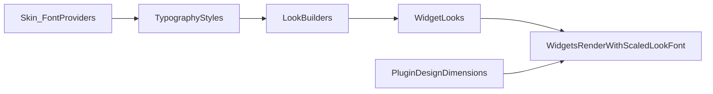

# Refactor Typography And Legacy Dimensions

## Objectives
- Centralize GUI typography variants in a dedicated `Typography` layer.
- Ensure all custom widgets render text from injected `look.font` (base design), then apply only display scaling at paint time.
- Remove obsolete skin value infrastructure (`SkinValueId` / `kDefaultValues` / `ISkinValues` path) now, with compile-safe cleanup.
- Prepare `PluginDesignDimensions` as the unique source of dimensions/paddings/gaps.

## Current State Confirmed
- `Button` still hard-overrides injected font height via local constant (`kFontSize_`) and still carries default width/height legacy in API.
- Multiple widgets still override font height locally (`Label`, `PatchNameDisplay`, `ComboBox`, `Slider`, `PopupMenuBase`, etc.).
- Skin values legacy is effectively orphaned: `SkinValueId` usage is isolated to skin implementation files only.

## Implementation Plan

### 1) Introduce centralized typography styles
- Add `TypographyStyles` in GUI Looks layer:
  - [/Volumes/Guillaume/Dev/SDKs/JUCE/Projects/Matrix-Control/Source/GUI/Looks/TypographyStyles.h](/Volumes/Guillaume/Dev/SDKs/JUCE/Projects/Matrix-Control/Source/GUI/Looks/TypographyStyles.h)
  - [/Volumes/Guillaume/Dev/SDKs/JUCE/Projects/Matrix-Control/Source/GUI/Looks/TypographyStyles.cpp](/Volumes/Guillaume/Dev/SDKs/JUCE/Projects/Matrix-Control/Source/GUI/Looks/TypographyStyles.cpp)
- Define enum for variants (`Default`, `Small`, `ModuleHeader`, `SectionHeader`, `PatchName`) mapped to current JUCE-validated visual sizes (not raw Figma sizes).
- Keep family/weight source in `Skin` (`getBaseFont()`, `getBaseFontBold()`), with style mapping done in `TypographyStyles`.

### 2) Apply typography through looks (no constructor bloat)
- Keep `juce::Font` directly in look structs (`ButtonLook` already compatible).
- Extend LookBuilders to assign typography variants explicitly where needed:
  - [/Volumes/Guillaume/Dev/SDKs/JUCE/Projects/Matrix-Control/Source/GUI/Looks/LookBuilders.h](/Volumes/Guillaume/Dev/SDKs/JUCE/Projects/Matrix-Control/Source/GUI/Looks/LookBuilders.h)
  - [/Volumes/Guillaume/Dev/SDKs/JUCE/Projects/Matrix-Control/Source/GUI/Looks/LookBuilders.cpp](/Volumes/Guillaume/Dev/SDKs/JUCE/Projects/Matrix-Control/Source/GUI/Looks/LookBuilders.cpp)
- Preserve current `Button` constructor shape (`width`, `height`, `look`, `text`) and inject typography through `look` only.

### 3) Remove widget-level font overrides and size defaults
- Refactor each target widget to draw from `look.font.getHeight()` (base design) and scale only at render:
  - [/Volumes/Guillaume/Dev/SDKs/JUCE/Projects/Matrix-Control/Source/GUI/Widgets/Button.h](/Volumes/Guillaume/Dev/SDKs/JUCE/Projects/Matrix-Control/Source/GUI/Widgets/Button.h)
  - [/Volumes/Guillaume/Dev/SDKs/JUCE/Projects/Matrix-Control/Source/GUI/Widgets/Button.cpp](/Volumes/Guillaume/Dev/SDKs/JUCE/Projects/Matrix-Control/Source/GUI/Widgets/Button.cpp)
  - [/Volumes/Guillaume/Dev/SDKs/JUCE/Projects/Matrix-Control/Source/GUI/Widgets/Label.h](/Volumes/Guillaume/Dev/SDKs/JUCE/Projects/Matrix-Control/Source/GUI/Widgets/Label.h)
  - [/Volumes/Guillaume/Dev/SDKs/JUCE/Projects/Matrix-Control/Source/GUI/Widgets/Label.cpp](/Volumes/Guillaume/Dev/SDKs/JUCE/Projects/Matrix-Control/Source/GUI/Widgets/Label.cpp)
  - [/Volumes/Guillaume/Dev/SDKs/JUCE/Projects/Matrix-Control/Source/GUI/Widgets/PatchNameDisplay.h](/Volumes/Guillaume/Dev/SDKs/JUCE/Projects/Matrix-Control/Source/GUI/Widgets/PatchNameDisplay.h)
  - [/Volumes/Guillaume/Dev/SDKs/JUCE/Projects/Matrix-Control/Source/GUI/Widgets/PatchNameDisplay.cpp](/Volumes/Guillaume/Dev/SDKs/JUCE/Projects/Matrix-Control/Source/GUI/Widgets/PatchNameDisplay.cpp)
  - [/Volumes/Guillaume/Dev/SDKs/JUCE/Projects/Matrix-Control/Source/GUI/Widgets/ComboBox.h](/Volumes/Guillaume/Dev/SDKs/JUCE/Projects/Matrix-Control/Source/GUI/Widgets/ComboBox.h)
  - [/Volumes/Guillaume/Dev/SDKs/JUCE/Projects/Matrix-Control/Source/GUI/Widgets/ComboBox.cpp](/Volumes/Guillaume/Dev/SDKs/JUCE/Projects/Matrix-Control/Source/GUI/Widgets/ComboBox.cpp)
  - [/Volumes/Guillaume/Dev/SDKs/JUCE/Projects/Matrix-Control/Source/GUI/Widgets/Slider.h](/Volumes/Guillaume/Dev/SDKs/JUCE/Projects/Matrix-Control/Source/GUI/Widgets/Slider.h)
  - [/Volumes/Guillaume/Dev/SDKs/JUCE/Projects/Matrix-Control/Source/GUI/Widgets/Slider.cpp](/Volumes/Guillaume/Dev/SDKs/JUCE/Projects/Matrix-Control/Source/GUI/Widgets/Slider.cpp)
  - [/Volumes/Guillaume/Dev/SDKs/JUCE/Projects/Matrix-Control/Source/GUI/Widgets/PopupMenuBase.h](/Volumes/Guillaume/Dev/SDKs/JUCE/Projects/Matrix-Control/Source/GUI/Widgets/PopupMenuBase.h)
  - [/Volumes/Guillaume/Dev/SDKs/JUCE/Projects/Matrix-Control/Source/GUI/Widgets/PopupMenuBase.cpp](/Volumes/Guillaume/Dev/SDKs/JUCE/Projects/Matrix-Control/Source/GUI/Widgets/PopupMenuBase.cpp)
- For `Button`, remove legacy default dimension API (`kDefaultWidth`, `kDefaultHeight`, `getBaseWidth`, `getBaseHeight`) while keeping internal border thickness constant.

### 4) Remove legacy skin value subsystem now
- Delete or fully retire:
  - [/Volumes/Guillaume/Dev/SDKs/JUCE/Projects/Matrix-Control/Source/GUI/Skins/ISkinValues.h](/Volumes/Guillaume/Dev/SDKs/JUCE/Projects/Matrix-Control/Source/GUI/Skins/ISkinValues.h)
  - [/Volumes/Guillaume/Dev/SDKs/JUCE/Projects/Matrix-Control/Source/GUI/Skins/SkinValues.h](/Volumes/Guillaume/Dev/SDKs/JUCE/Projects/Matrix-Control/Source/GUI/Skins/SkinValues.h) (legacy enums/arrays)
- Update skin interfaces/implementation and includes:
  - [/Volumes/Guillaume/Dev/SDKs/JUCE/Projects/Matrix-Control/Source/GUI/Skins/ISkin.h](/Volumes/Guillaume/Dev/SDKs/JUCE/Projects/Matrix-Control/Source/GUI/Skins/ISkin.h)
  - [/Volumes/Guillaume/Dev/SDKs/JUCE/Projects/Matrix-Control/Source/GUI/Skins/Skin.h](/Volumes/Guillaume/Dev/SDKs/JUCE/Projects/Matrix-Control/Source/GUI/Skins/Skin.h)
  - [/Volumes/Guillaume/Dev/SDKs/JUCE/Projects/Matrix-Control/Source/GUI/Skins/Skin.cpp](/Volumes/Guillaume/Dev/SDKs/JUCE/Projects/Matrix-Control/Source/GUI/Skins/Skin.cpp)
- Ensure all dimensions remain sourced by:
  - [/Volumes/Guillaume/Dev/SDKs/JUCE/Projects/Matrix-Control/Source/Shared/Definitions/PluginDesignDimensions.h](/Volumes/Guillaume/Dev/SDKs/JUCE/Projects/Matrix-Control/Source/Shared/Definitions/PluginDesignDimensions.h)

### 5) Validation and safety checks
- Build compile pass via current CMake target.
- Focused UI sanity checks on text rendering parity for key widgets/panels.
- Lint pass on edited files.
- Verify no remaining `SkinValueId` / `kDefaultValues` references.

## Dependency Flow Target

## Notes
- Keep JUCE visual size values currently validated in project as canonical for now, even when they differ from raw Figma numeric sizes.
- This iteration intentionally includes broader cleanup to avoid mixed old/new typography behavior across widgets.
