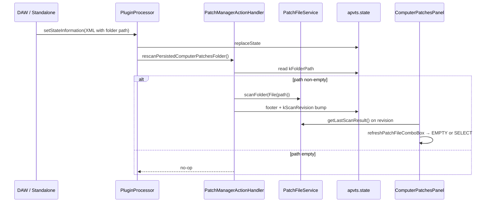

# Story 4.3: Folder Path Persistence

Status: done

<!-- Ultimate context engine analysis completed — comprehensive developer guide created -->

## Story

As a sound designer,
I want my last folder remembered across sessions,
so that I resume browsing without re-picking each launch (FR-27).

## Acceptance Criteria

1. **Given** Stories 4.1 and 4.2 complete (`PatchFileService`, OPEN scan, combobox sentinel FSM, `kScanRevision` refresh) **When** user confirms OPEN and scan succeeds on a valid directory **Then** the absolute folder path is stored in an APVTS state property and survives `getStateInformation` / `setStateInformation` round-trip (session XML prefs per AD-7 / D-010).
2. **And** when user cancels the folder picker or picks a non-directory **Then** the persisted path is **unchanged** (no write, no rescan).
3. **And** on plugin relaunch / DAW session restore **When** a non-empty persisted path exists **Then** `PatchFileService::scanFolder` runs automatically on the message thread **without** opening a file picker, **without** loading a `.syx` into `PatchModel`, **without** mutating APVTS patch parameters, and **without** enqueueing patch **0x01** SysEx.
4. **And** after startup rescan **Then** footer shows the same scan outcome as manual OPEN (valid/invalid counts, `"0 files in folder"`, or `"Folder not found"`); combobox reflects sentinel FSM via existing `kScanRevision` bump (`<EMPTY>` or `<SELECT>` per Story 4.2 — **not** auto-selecting a file).
5. **And** when persisted path is empty (fresh install / never opened) **Then** no startup scan runs; combobox stays `<EMPTY>` until user OPENs.
6. **And** when persisted path points to a missing or unreadable directory **Then** startup rescan sets `folderUsable == false`, footer warning `"Folder not found"`, combobox `<EMPTY>` grayed — same UX as manual OPEN on bad path.
7. **And** re-scan via OPEN on a **new** folder updates the persisted path to the new folder (replacing the old path).
8. **And** property id `computerPatchesFolderPath` lives under `PluginIDs::PatchManagerSection::ComputerPatchesModule::StateProperties`; default value is empty string on first run.
9. **And** unit tests cover: OPEN persists path; cancel does not; startup rescan from saved path; missing path on startup; session XML round-trip retains path; queue remains empty after startup rescan. Full `Matrix-Control_Tests` suite passes.

## Tasks / Subtasks

- [x] **Add persisted folder path property** (AC: #1, #8)
  - [x] `PluginIDs.h` — `StateProperties::kFolderPath = "computerPatchesFolderPath"`
  - [x] `PluginProcessor::initializeComputerPatchesFolderProperty()` — default `""` if missing (mirror `initializeInitTemplatesFolderProperty`)

- [x] **Extract shared scan-publish helper** (AC: #1, #3, #4)
  - [x] `PatchManagerActionHandler` — private `scanAndPublishFolder(const juce::File&)` encapsulates: `scanFolder` → `PatchFileServiceFooter::propagateScanResult` → bump `kScanRevision`
  - [x] Refactor `handleOpenPatchFolder()` to call helper after successful picker

- [x] **Persist path on OPEN** (AC: #1, #2, #7)
  - [x] After confirmed directory pick, `apvts_.state.setProperty(kFolderPath, folder.getFullPathName(), nullptr)` **before** scan
  - [x] Cancel / invalid picker result → early return with no property write

- [x] **Startup rescan orchestration** (AC: #3–#6)
  - [x] `PatchManagerActionHandler::rescanPersistedComputerPatchesFolder()` — read `kFolderPath`; if non-empty, `scanAndPublishFolder(juce::File(path))`
  - [x] `PluginProcessor::setStateInformation` — after `replaceState` and existing sync helpers, call `patchManagerActionHandler_->rescanPersistedComputerPatchesFolder()`
  - [x] `PluginProcessor` constructor — after `initializeComputerPatchesFolderProperty()`, call same rescan (covers standalone hosts that do not invoke `setStateInformation` on first editor open with default in-memory state only when path already set — harmless no-op when empty)
  - [x] Do **not** trigger rescan from GUI / `ComputerPatchesPanel` — Core orchestration only

- [x] **Unit tests** (AC: #9)
  - [x] `PatchManagerActionHandlerTests` — `open_persistsFolderPath`: fake picker returns temp dir → property set to `getFullPathName()`
  - [x] `open_cancelled_doesNotPersist`: picker returns invalid `File` → property unchanged
  - [x] `rescanPersistedFolder_scansOnStartup`: pre-set property → call `rescanPersistedComputerPatchesFolder()` → `getLastScanResult()` populated, footer set, `kScanRevision` > 0
  - [x] `rescanPersistedFolder_missingPath_warningFooter`: property points to nonexistent dir → `folderUsable == false`, warning footer
  - [x] `rescanPersistedFolder_emptyPath_noOp`: property `""` → last scan remains default, no footer from scan
  - [x] Assert `MidiOutboundQueue` empty after startup rescan (no SysEx)

- [x] **Self-review** (AC: #3)
  - [x] No patch load / save / prev-next load / name reconciliation
  - [x] No new GUI files unless a test hook is needed
  - [x] Methods ≤ 15 lines; English only in source

### Review Findings

- [x] [Review][Patch] Cache scan obsolète quand le chemin persisté est vide après un scan précédent [`PatchManagerActionHandler.cpp:253`]
- [x] [Review][Defer] Lacunes de tests (remplacement AC #7, intégration `PluginProcessor`, assert `kScanRevision` faible) — couverture optionnelle, conformité AC validée
- [x] [Review][Defer] Chemins absolus non portables entre machines [`PatchManagerActionHandler.cpp:241`] — v1 AD-7 / D-010, hors périmètre
- [x] [Review][Defer] Scan synchrone sur `setStateInformation` [`PluginProcessor.cpp:565`] — acceptable v1 (story 4.1)
- [x] [Review][Defer] `handleOpenPatchFolder` 16 lignes [`PatchManagerActionHandler.cpp:230`] — dette style mineure
- [x] [Review][Defer] Chemin whitespace / relatif / XML corrompu non validé [`PatchManagerActionHandler.cpp:249`] — entrées manuelles improbables
- [x] [Review][Defer] `kScanRevision` via `getMillisecondCounterHiRes()` — pattern hérité story 4.2

## Dev Notes

### What this story IS — and what it is NOT

Story 4.3 adds **session persistence of the Computer Patches library folder** and **automatic rescan on relaunch** per FR-27 / D-010.

It must **NOT** in this story:
- Auto-load a selected `.syx` or restore `computerPatchesSelectPatch` across sessions as a load trigger (**Story 4.5** load; startup rescan must leave combobox at `<SELECT>` or `<EMPTY>` only)
- Save / Save As / filename injection (**Story 4.4**)
- Implement Previous/Next **load** (**Story 4.6**)
- Name reconciliation (**Story 4.5**)
- Add Settings UI browse row for default folder (**Story 7.7** — OPEN remains the v1 folder picker)
- Persist sorted file list to APVTS (list stays in `PatchFileService` last-scan cache only)
- `DirtyPatchTracker` (**Epic 9**)

[Source: Story 4.2 deferrals; epics.md Story 4.3; D-010]

### Persistence model (authoritative)

| Concern | Mechanism |
|---|---|
| Storage | APVTS `ValueTree` property on `apvts.state` |
| Serialization | Existing `PluginProcessor::getStateInformation` / `setStateInformation` — `apvts.copyState()` → XML binary blob |
| Property key | `computerPatchesFolderPath` (`kFolderPath`) |
| Default | Empty string — means "no folder configured" |
| Write trigger | Successful OPEN (user confirmed directory) |
| Read trigger | `setStateInformation` + constructor init after property defaulting |
| Scan side effects | Footer + `kScanRevision` bump only — UI refresh via Story 4.2 listener |

**Do not** add a separate prefs file or `PropertiesFile` — AD-7 lists plugin prefs in session XML alongside ports, skin, INIT template path (`settingsInitTemplatesFolderPath`).

[Source: architecture.md AD-7; `PluginProcessor.cpp:539-564`; Story 3.2 init-templates pattern]

### Startup rescan flow



**Critical:** Startup rescan is **not** user OPEN — no `FileChooser`, no property write (path already persisted). Reuse the same scan + footer + revision path as OPEN so combobox FSM stays consistent.

### Brownfield state (READ before editing)

| File | Current behaviour | This story changes |
|---|---|---|
| `PatchManagerActionHandler.cpp:230-246` | OPEN → scan → footer → `kScanRevision` | Also persist `kFolderPath`; extract `scanAndPublishFolder`; add `rescanPersistedComputerPatchesFolder` |
| `PluginProcessor.cpp:546-564` | `setStateInformation` syncs MIDI/audio/latency | Also call startup rescan |
| `PluginProcessor.cpp:291-294` | Inits MIDI, latency, init-templates path | Add `initializeComputerPatchesFolderProperty` + startup rescan |
| `PluginIDs.h:557-560` | Only `kScanRevision` in ComputerPatches state props | Add `kFolderPath` |
| `ComputerPatchesPanel.cpp` | Listens to `kScanRevision`, reads service cache | **No change required** if rescan bumps revision |
| `getStateInformation` | Copies full APVTS state | **No change** — new property auto-included |

### Suggested handler API

```cpp
// PatchManagerActionHandler.h (private)
void scanAndPublishFolder(const juce::File& folder);
void bumpScanRevision();

public:
void rescanPersistedComputerPatchesFolder();

// PatchManagerActionHandler.cpp
void PatchManagerActionHandler::handleOpenPatchFolder()
{
    if (patchFileService_ == nullptr || ! pickFolder_)
        return;

    const juce::File folder = pickFolder_();
    if (! folder.isDirectory())
        return;

    apvts_.state.setProperty(ComputerPatchesModule::StateProperties::kFolderPath,
                             folder.getFullPathName(),
                             nullptr);
    scanAndPublishFolder(folder);
}

void PatchManagerActionHandler::rescanPersistedComputerPatchesFolder()
{
    const auto path = apvts_.state.getProperty(
        ComputerPatchesModule::StateProperties::kFolderPath,
        juce::String()).toString();

    if (path.isEmpty())
        return;

    scanAndPublishFolder(juce::File(path));
}
```

Use `folder.getFullPathName()` for persistence (absolute path survives cwd changes). JUCE `File` constructor accepts absolute path strings on all platforms.

### No auto-load guardrails

After startup rescan, Story 4.2 `refreshPatchFileComboBox()` (triggered by `kScanRevision`) **clears** `computerPatchesSelectPatch` and shows `<SELECT>` when `validCount > 0`. Verify this path is not bypassed.

**Must not call:** `PatchInitService`, `apvtsPatchMapper_->bufferToApvts` from file bytes, `midiManager_->sendPatch`, or any load handler stub for `computerPatchesSelectPatch`.

Optional defensive check in tests: snapshot `PatchModel` bytes or a known APVTS parameter before/after rescan — unchanged.

### Architecture compliance

- **Core ↛ GUI:** persistence + startup rescan in `PatchManagerActionHandler` / `PluginProcessor` — no panel changes.
- **Composition root:** `PluginProcessor` invokes handler after state restore (AD-2).
- **Separate from InitTemplateLoader:** Computer Patches folder ≠ INIT templates folder (`settingsInitTemplatesFolderPath`) — D-034a.
- **Threading:** Rescan synchronous on message thread (same as OPEN — acceptable v1 per Story 4.1).
- **Idempotency:** Repeated rescan of same path replaces `lastScan_` entirely.

### File structure (this story)

```
Source/Shared/Definitions/
└── PluginIDs.h                          (UPDATE — kFolderPath)

Source/Core/Actions/
├── PatchManagerActionHandler.h          (UPDATE — rescanPersisted + scanAndPublishFolder)
└── PatchManagerActionHandler.cpp        (UPDATE — persist on OPEN, startup rescan)

Source/Core/
├── PluginProcessor.h                    (UPDATE — initializeComputerPatchesFolderProperty declare)
└── PluginProcessor.cpp                  (UPDATE — init property, setStateInformation hook)

Tests/Unit/
└── PatchManagerActionHandlerTests.cpp   (UPDATE — persistence + startup rescan tests)
```

No new `.cpp` files. No CMake changes unless test file already registered (it is).

### Testing requirements

Follow `PatchFileServiceTests` / existing `PatchManagerActionHandlerTests` harness (`HandlerHarness` with `patchFileService`).

| Test | Setup | Assert |
|---|---|---|
| `open_persistsFolderPath` | Temp dir with one valid fixture; picker returns it | `kFolderPath == temp.getFullPathName()`, scan counts correct |
| `open_cancelled_noPersist` | Pre-set path to `/tmp/keep`; picker returns `{}` | Property still `/tmp/keep` (or unchanged) |
| `rescanPersisted_validFolder` | Set property to temp dir with fixtures; call rescan | `validCount > 0`, footer info, `kScanRevision` changed |
| `rescanPersisted_missingFolder` | Property `/nonexistent/path` | `folderUsable == false`, warning footer |
| `rescanPersisted_emptyPath` | Property `""` | Default `lastScan_`, no scan side effects |
| `rescanPersisted_noSysEx` | Same as valid rescan | `scanQueue(queue).patchData == false` |

**Manual smoke (required):**

1. Fresh plugin → `<EMPTY>` → OPEN folder with patches → quit → relaunch → folder rescanned, `<SELECT>` shown, footer counts, **no** patch parameter change.
2. Relaunch with deleted folder path in saved session → `<EMPTY>` + `"Folder not found"`.
3. OPEN new folder → path updates; relaunch uses new folder.
4. Cancel OPEN → previously persisted folder still used on next relaunch.

### Previous story intelligence (Story 4.2)

| Learning | Application in 4.3 |
|---|---|
| `kScanRevision` triggers combobox refresh | Startup rescan **must** bump revision — same helper as OPEN |
| `getLastScanResult()` is SSOT for file list | Rescan populates cache before editor opens; panel ctor `refreshPatchFileComboBox()` reads cache |
| Re-scan clears file selection | Startup rescan behaves like OPEN re-scan — no stale selection |
| `const PatchFileService&` in panel | No panel changes — processor/handler drives scan |
| Sentinel `<EMPTY!>` / `<SELECT>` | Persisted missing folder → EMPTY; populated folder → SELECT |
| Review: `getMillisecondCounterHiRes()` for revision | Reuse same bump pattern in `scanAndPublishFolder` |

### Previous story intelligence (Story 4.1)

| Learning | Application in 4.3 |
|---|---|
| `scanFolder` + footer propagation pattern | Reuse via `scanAndPublishFolder` — do not duplicate |
| `PatchFileServiceFooter::propagateScanResult` | Call for both OPEN and startup rescan |
| Injected picker only for user OPEN | Startup rescan reads APVTS path directly — no picker |
| Last-scan cache for 4.2–4.6 | Startup rescan fills cache on relaunch |

### Git intelligence (recent commits)

`4d73254` — Story 4.2 wired combobox sentinel FSM, `kScanRevision`, service ref injection. Persistence layer must **reuse** revision bump so panel refreshes without GUI edits.

`5bed772` — Story 4.1 landed `PatchFileService` and OPEN handler. This story completes the FR-27 half of D-024/D-010 (persist + relaunch rescan).

### Latest tech information

- **JUCE 8.0.12** — `juce::File::getFullPathName()` for cross-platform absolute paths in XML; `File(pathString)` round-trips on macOS/Windows/Linux.
- **APVTS state properties** — non-parameter properties on `apvts.state` persist automatically through `copyState()` / `replaceState()`; no `AudioProcessorValueTreeState::Parameter` wrapper needed for folder path.
- **DAW lifecycle** — `setStateInformation` may run before `createEditor`; service cache must be populated in processor so first panel paint sees scan results.
- **No new dependencies.**

### Project context reference

- `Core ↛ GUI` strict [project-context.md]
- Clean Code: methods ≤ 15 lines, classes ≤ 200 lines [CONVENTIONS.md]
- English only in source/comments [project-context.md]
- Tests: JUCE `UnitTest`, temp dirs under `juce::File::tempDirectory` [project-context.md]
- Session prefs in APVTS XML — D-010 validated policy

### References

- [Source: `_bmad-output/planning-artifacts/epics.md` — Epic 4 Story 4.3, FR-27]
- [Source: `_bmad-output/planning-artifacts/prds/.../prd.md` — FR-27, §4.8 prefs list]
- [Source: `_bmad-output/planning-artifacts/prds/.../.decision-log.md` — D-010, D-024]
- [Source: `_bmad-output/planning-artifacts/architecture/.../architecture.md` — AD-7 persistence boundaries]
- [Source: `implementation-artifacts/4-1-patchfileservice-folder-scan.md` — scan API, defer 4.3]
- [Source: `implementation-artifacts/4-2-combobox-sentinel-states.md` — kScanRevision refresh, defer 4.3]
- [Source: `Source/Core/Actions/PatchManagerActionHandler.cpp:230-246` — OPEN handler to extend]
- [Source: `Source/Core/PluginProcessor.cpp:539-564` — state restore hook]
- [Source: `Source/Core/PluginProcessor.cpp:777-781` — init-templates folder property pattern]
- [Source: `Source/Shared/Definitions/PluginIDs.h:557-560` — StateProperties namespace]

## Dev Agent Record

### Agent Model Used

Composer (Cursor)

### Debug Log References

- Built and ran `Matrix-Control_Tests` — all tests pass (exit 0)

### Completion Notes List

- Added `computerPatchesFolderPath` APVTS state property with empty-string default via `initializeComputerPatchesFolderProperty()`.
- Extracted `scanAndPublishFolder` / `bumpScanRevision` helpers; OPEN persists absolute path before scan; cancel leaves property unchanged.
- Added `rescanPersistedComputerPatchesFolder()` invoked from `PluginProcessor` constructor and `setStateInformation` — no GUI changes, no patch load/SysEx.
- Seven new unit tests cover OPEN persist/cancel, startup rescan (valid/missing/empty path), session XML round-trip, and empty MIDI queue after rescan.

### File List

- `Source/Shared/Definitions/PluginIDs.h`
- `Source/Core/Actions/PatchManagerActionHandler.h`
- `Source/Core/Actions/PatchManagerActionHandler.cpp`
- `Source/Core/PluginProcessor.h`
- `Source/Core/PluginProcessor.cpp`
- `Tests/Unit/PatchManagerActionHandlerTests.cpp`

### Change Log

- 2026-06-19 — Story 4.3: folder path persistence in APVTS, startup rescan on session restore, unit tests
