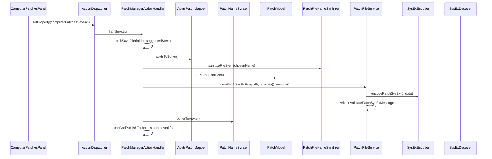

# Story 4.4: Save with Filename Injection

Status: done

<!-- Ultimate context engine analysis completed — comprehensive developer guide created -->

## Story

As a sound designer,
I want Save/Save As to write sanitized 8-char names into patch bytes,
so that files and patch name stay consistent (FR-28).

## Acceptance Criteria

1. **Given** Stories 4.1–4.3 complete (`PatchFileService`, folder scan, combobox sentinel FSM, persisted folder path) and Story 1.5 complete (`PatchNameSyncer`, `PatchModel::setName` / bytes 0–7) **When** user clicks **SAVE AS** **Then** a native save-file dialog opens on the message thread (injected picker — Core ↛ GUI), default directory = persisted `computerPatchesFolderPath` when usable, suggested stem = current `patchEditPatchName` property (sanitized) or `"PATCH"` fallback; on confirm, current edit is written as a valid single-patch `.syx` file.
2. **And** **SAVE AS** flow: `ApvtsPatchMapper::apvtsToBuffer()` captures latest parameters → filename stem is **sanitized to 8 Matrix-compatible uppercase characters** (forbidden / non-printable / OS-illegal chars removed or replaced per D-025) → sanitized stem is injected into bytes 0–7 via `PatchModel::setName()` (do **not** reimplement charset logic) → `SysExEncoder::encodePatchSysEx(0, packedData)` builds file payload (patch number **0** — same convention as `GenerateInitFixtures` / `InitDefaultsTests`) → file bytes written atomically → post-write `SysExDecoder::validatePatchSysExMessage` passes on disk file.
3. **And** after successful **SAVE AS** **Then** `PatchNameSyncer::bufferToApvts()` updates `patchEditPatchName` to match injected name; footer shows **info** success message including final filename; folder is rescanned via existing `scanAndPublishFolder` (updates combobox list + `kScanRevision`); combobox selects the new file when present in scan results.
4. **And** **When** user clicks **SAVE** with combobox in **FileSelected** state (`computerPatchesSelectPatch >= 1`) and usable folder **Then** overwrites the corresponding file in the persisted/scanned folder **without** a file dialog — same sanitize → inject → encode → validate → footer → rescan path as SAVE AS.
5. **And** **SAVE** is a no-op (no file write, no footer success) when combobox is in `<EMPTY>` / `<SELECT>` sentinel state, folder unusable, or required dependencies null — same silent early-return pattern as cancelled OPEN.
6. **And** cancel / invalid save dialog result leaves disk, APVTS patch parameters, and combobox selection unchanged.
7. **And** save operations do **not** enqueue patch **0x01** SysEx, do **not** mutate internal bank/patch coordinates, and do **not** trigger load/reconciliation logic (Stories 4.5–4.6).
8. **And** `PatchFileNameSanitizer` (or equivalent small Core helper) centralizes stem sanitization for save **and** future Story 4.5 reconciliation — lives under `Source/Core/` with zero GUI deps; unit-tested independently.
9. **And** `PatchFileService` gains a write API (e.g. `savePatchSysExFile`) that owns encode-to-disk + post-write validation; handler orchestrates APVTS/model sync and pickers only.
10. **And** unit tests cover: sanitizer edge cases (long names, lowercase, forbidden chars, empty → fallback); successful SAVE AS write + validation; SAVE overwrite of selected file; cancel/no-op paths; `MidiOutboundQueue` remains empty after save. Full `Matrix-Control_Tests` suite passes.

## Tasks / Subtasks

- [x] **Add filename sanitizer** (AC: #2, #8)
  - [x] `Source/Core/Services/PatchFileNameSanitizer.{h,cpp}` — `sanitizeToMatrixName(juce::String)` → max 8 chars, uppercase, Matrix-safe charset; `sanitizeFileStem(juce::String)` strips `.syx`, path segments, OS-forbidden chars first
  - [x] `Tests/Unit/PatchFileNameSanitizerTests.cpp` — long input, lowercase fold, punctuation, empty → `"PATCH"` or space-pad policy (document choice in tests)

- [x] **Extend `PatchFileService` write path** (AC: #2, #9)
  - [x] `savePatchSysExFile(const juce::File& targetFile, const juce::uint8* packedData, SysExEncoder& encoder)` — encode, `replaceWithData`, validate read-back
  - [x] Return structured result (`success`, `errorMessage`) for footer propagation
  - [x] `Tests/Unit/PatchFileServiceTests.cpp` — round-trip write fixture buffer to temp file, validate; write failure (non-writable dir) handled

- [x] **Add save-file picker injection** (AC: #1, #6)
  - [x] `PatchSaveFilePicker = std::function<juce::File(juce::File suggestedFolder, juce::String suggestedStem)>`
  - [x] `PluginProcessor::setPatchSaveFilePicker(...)` — default returns invalid `File`
  - [x] `PluginEditor` registers `FileChooser` save dialog (`*.syx`, `canSelectFiles=true`, `canSelectDirectories=false`, message thread)

- [x] **Wire handler actions** (AC: #1–#7)
  - [x] Inject `PatchNameSyncer*`, `SysExEncoder*` (from `MidiManager`) into `PatchManagerActionHandler`
  - [x] `handleSavePatchAs()` — picker → sanitize stem → `saveCurrentPatchToFile`
  - [x] `handleSavePatchFile()` — resolve selected filename from `getLastScanResult().sortedValidFileNames` + `computerPatchesSelectPatch`
  - [x] Private helper `saveCurrentPatchToFile(const juce::File& targetFile)` — mapper sync, inject name, service write, name sync to APVTS, rescan, select new file id in APVTS if applicable
  - [x] Replace Epic 4 stub branch for `computerPatchesSaveAs` / `computerPatchesSave`

- [x] **Footer success messages** (AC: #3)
  - [x] `PluginDisplayNames::ComputerPatchesModule::FooterMessages::formatSaveSuccess(fileName)` (or similar)

- [x] **Self-review** (AC: #7)
  - [x] No load / reconciliation / prev-next / DirtyPatchTracker
  - [x] Methods ≤ 15 lines; English only in source
  - [x] No GUI changes beyond picker registration in `PluginEditor`

## Dev Notes

### What this story IS — and what it is NOT

Story 4.4 delivers **Computer Patches SAVE / SAVE AS** with **FR-28 filename → bytes 0–7 injection** per D-025.

It must **NOT** in this story:
- Load `.syx` into `PatchModel` or apply name reconciliation policy (**Story 4.5** — FR-29)
- Implement Previous/Next **load** (**Story 4.6** — FR-52)
- `DirtyPatchTracker` unsaved warning on save/navigation (**Epic 9** — FR-51)
- Send patch **0x01** SysEx to synth on save (file export only)
- Mutator export layout (**Epic 6** / FR-33)
- Settings browse row for default folder (**Story 7.7** — folder comes from OPEN / persisted path)

[Source: epics.md Story 4.4; D-025; FR-28]

### Save semantics (authoritative)

| Action | Dialog | Target path | Preconditions |
|---|---|---|---|
| **SAVE AS** | Native save-file chooser | User-chosen path (any folder v1 — vision allows folder pick; default to persisted library folder) | Always attempts when picker registered; silent no-op if picker returns invalid file |
| **SAVE** | None | `{scanFolder}/{selectedFileName}` | Usable folder + `computerPatchesSelectPatch >= 1` + file still in last scan list |

**Post-save side effects (both):**
1. Inject sanitized stem into bytes 0–7
2. Write `.syx` validated on disk
3. Sync `patchEditPatchName` APVTS property from buffer
4. Rescan library folder (prefer persisted `kFolderPath` when set, else `getLastScanResult().folder`)
5. Bump `kScanRevision` (via `scanAndPublishFolder`)
6. Set `computerPatchesSelectPatch` to id of saved filename when found in rescanned list

**No synth SysEx** — verify `MidiOutboundQueue` empty in tests (same harness as Story 4.3).

[Source: vision-input-fr §3.3 SAVE / SAVE AS; D-025; Story 4.2 selection property]

### Filename sanitization (D-025)

Decision log: *"validated filename (8 chars, forbidden chars filtered) injected into patch name SysEx bytes"*.

Implementation guidance:
- **Do not duplicate** `PatchModel` 6-bit charset encoding — call `PatchModel::setName(sanitizedStem)` after sanitization.
- **Sanitizer responsibility:** produce a stem suitable for **both** filesystem and Matrix name (vision: 8 ASCII chars, some forbidden).
- **Recommended v1 rules:**
  - Strip directory components and `.syx` extension from user input
  - Remove OS-forbidden characters (`/ \ : * ? " < > |` and control chars)
  - Uppercase (Matrix display is uppercase-only — Story 1.1 review)
  - Keep printable ASCII subset compatible with `PatchModel::setName` (A–Z, 0–9, space, common symbols seen in factory names)
  - Replace disallowed characters with `_` or drop them (pick one; test it)
  - Truncate to 8 chars; if empty after sanitization use `"PATCH"` (8 chars or space-pad via `setName`)
- Story 4.5 reconciliation will reuse the same sanitizer — keep API in Core Services, not handler-private.

[Source: `.decision-log.md` D-025; `PatchModel.cpp:62-69`; Story 1.5 dev notes]

### Save pipeline (sequence)



**Order matters:** mapper before name injection so parameter bytes reflect latest APVTS; name injection **overwrites** bytes 0–7 intentionally (filename wins on export per D-025).

### Brownfield state (READ before editing)

| File | Current behaviour | This story changes |
|---|---|---|
| `PatchManagerActionHandler.cpp:92-98` | SAVE / SAVE AS → `return; // Epic 4` | Implement handlers |
| `PatchFileService.h` | Scan + cache only | Add `savePatchSysExFile` |
| `PluginEditor.cpp:74-90` | Folder picker registered | Also register save-file picker |
| `ComputerPatchesPanel.cpp:329-356` | Buttons fire APVTS action properties | **No change** (ActionDispatcher path) |
| `PatchNameSyncer` | APVTS ↔ bytes 0–7 sync | Used after injection (`bufferToApvts`) |
| `PatchModel::setName` | Charset + uppercase + 8-byte pad | Called with sanitized stem — **do not modify** |
| `SysExEncoder::encodePatchSysEx` | MIDI + file encoding | Use patch number **0** for library files |

### Suggested APIs

```cpp
// PatchFileNameSanitizer.h
namespace Core {
    struct PatchFileNameSanitizer {
        static juce::String sanitizeFileStem(juce::String input);
        static juce::String sanitizeToMatrixName(juce::String stem);
        static juce::String ensureSyxExtension(const juce::String& stem);
    };
}

// PatchFileService.h
struct PatchFileSaveResult {
    bool success = false;
    juce::String errorMessage;
};

PatchFileSaveResult savePatchSysExFile(const juce::File& targetFile,
                                       const juce::uint8* packedData,
                                       SysExEncoder& encoder);

// PatchManagerActionHandler.h
using PatchSaveFilePicker = std::function<juce::File(juce::File suggestedFolder,
                                                       juce::String suggestedStem)>;
```

```cpp
void PatchManagerActionHandler::saveCurrentPatchToFile(const juce::File& targetFile)
{
    if (patchModel_ == nullptr || apvtsPatchMapper_ == nullptr
        || patchFileService_ == nullptr || patchNameSyncer_ == nullptr
        || sysExEncoder_ == nullptr)
        return;

    apvtsPatchMapper_->apvtsToBuffer();

    const auto stem = PatchFileNameSanitizer::sanitizeFileStem(targetFile.getFileNameWithoutExtension());
    patchModel_->setName(stem);

    const auto result = patchFileService_->savePatchSysExFile(
        targetFile.withFileExtension(PatchFileService::kSyxExtension),
        patchModel_->data(),
        *sysExEncoder_);

    if (! result.success)
    {
        // warning footer via uiMessageText / uiMessageSeverity
        return;
    }

    patchNameSyncer_->bufferToApvts();
    publishSaveSuccessFooter(targetFile.getFileName());
    rescanAndSelectSavedFile(targetFile.getFileName());
}
```

### File write + validation contract

Reuse validation symmetry from Story 4.1 scan:

```132:141:Source/Core/MIDI/SysEx/SysExDecoder.cpp
bool SysExDecoder::validatePatchSysExMessage(const juce::MemoryBlock& sysEx) const
{
    auto validation = parser.validateSysEx(sysEx);
    if (!validation.isValid || validation.messageType != SysExParser::MessageType::kPatch)
    {
        MidiLogger::getInstance().logError("decodePatchSysEx: validation failed");
        return false;
    }
    return true;
}
```

After `targetFile.replaceWithData(encoded.getData(), encoded.getSize())`, read back with `loadFileAsData` and validate — guarantees FR-28 "passes SysEx validation tests".

Reference round-trip pattern exists in `PatchModelTests.cpp` (encode → validate).

### Save-file picker (mandatory — Core ↛ GUI)

Mirror folder picker from Story 4.1 / 4.3:

```cpp
// PluginEditor.cpp — message thread only
pluginProcessor.setPatchSaveFilePicker(
    [safeThis = juce::Component::SafePointer<PluginEditor>(this)](
        juce::File suggestedFolder, juce::String suggestedStem) -> juce::File
    {
        if (safeThis == nullptr)
            return {};

        juce::FileChooser chooser("Save patch as",
                                  suggestedFolder.getChildFile(suggestedStem + ".syx"),
                                  "*.syx",
                                  true, false, false,
                                  safeThis.getComponent());

        if (chooser.browseForFileToSave(true))
            return chooser.getResult();

        return {};
    });
```

Use `browseForFileToSave(true)` for overwrite confirmation on SAVE AS.

### Architecture compliance

- **Core ↛ GUI:** encode/write/validate/sanitize in Core; only `FileChooser` in `PluginEditor`.
- **Composition root:** `PluginProcessor` wires encoder reference from `MidiManager`, registers pickers (AD-2).
- **Separate from InitTemplateLoader:** Computer Patches save ≠ INIT template save (D-034a).
- **Threading:** synchronous on message thread (acceptable v1 — same as scan).
- **Idempotency:** SAVE overwrites target file; rescan replaces cache entirely.

### File structure (this story)

```
Source/Core/Services/
├── PatchFileNameSanitizer.h          (NEW)
├── PatchFileNameSanitizer.cpp        (NEW)
├── PatchFileService.h                (UPDATE — save API + result struct)
└── PatchFileService.cpp              (UPDATE — savePatchSysExFile)

Source/Core/Actions/
├── PatchManagerActionHandler.h       (UPDATE — picker, encoder, name syncer deps)
└── PatchManagerActionHandler.cpp     (UPDATE — SAVE / SAVE AS handlers)

Source/Core/
├── PluginProcessor.h                 (UPDATE — setPatchSaveFilePicker)
└── PluginProcessor.cpp               (UPDATE — pass deps to handler)

Source/GUI/
└── PluginEditor.cpp                  (UPDATE — save-file picker)

Source/Shared/Definitions/
└── PluginDisplayNames.h              (UPDATE — save success footer helper)

Tests/Unit/
├── PatchFileNameSanitizerTests.cpp   (NEW)
├── PatchFileServiceTests.cpp         (UPDATE — write + validate)
└── PatchManagerActionHandlerTests.cpp (UPDATE — save/no-op/cancel tests)
```

Register new `.cpp` files in plugin + `Matrix-Control_Tests` `CMakeLists.txt`.

### Testing requirements

| Test | Setup | Assert |
|---|---|---|
| `sanitize_truncatesToEight` | `"LONGNAMEHERE"` | length ≤ 8, uppercase |
| `sanitize_stripsForbiddenOsChars` | `"A/B:C*?"` | no `/:*?` in output |
| `sanitize_emptyFallback` | `""` | non-empty default |
| `savePatchSysExFile_validRoundTrip` | InitDefaults buffer → temp `.syx` | file exists, validate passes |
| `saveAs_writesAndRescans` | Handler harness + fake save picker | file on disk, footer success, scan revision bumped |
| `save_overwritesSelectedFile` | Pre-scan temp dir + combobox selection | same filename updated, validate passes |
| `save_selectSentinelNoOp` | `computerPatchesSelectPatch == 0` | no file created |
| `save_cancelledNoWrite` | Picker returns invalid | folder unchanged |
| `save_noSysEx` | After save | `MidiOutboundQueue` empty |

Use `HandlerHarness` from `PatchManagerActionHandlerTests` — extend with `patchNameSyncer`, fake save picker, temp scan dirs (Story 4.3 patterns).

### Previous story intelligence (Story 4.3)

| Learning | Application in 4.4 |
|---|---|
| `scanAndPublishFolder` + `kScanRevision` | Call after successful save so combobox sees new/overwritten file |
| Persisted `kFolderPath` | SAVE AS default folder; SAVE target folder |
| `clearPublishedScanCache` pattern | Not needed on save — rescan replaces cache |
| Injected pickers only from GUI | Add parallel save-file picker injection |
| Review: no SysEx on file ops | Assert queue empty after save |

### Previous story intelligence (Story 4.2)

| Learning | Application in 4.4 |
|---|---|
| `computerPatchesSelectPatch` 1-based index | SAVE resolves filename from `sortedValidFileNames[id - 1]` |
| Sentinel states block SAVE | SAVE no-op when `selectedId == 0` |
| Post-rescan selection | After SAVE AS, set property to new file's id or fall back to `<SELECT>` |

### Previous story intelligence (Story 1.5)

| Learning | Application in 4.4 |
|---|---|
| `PatchNameSyncer` owns APVTS ↔ bytes 0–7 | Call `bufferToApvts()` after injection so PATCH NAME display matches file |
| Do not reimplement charset | Sanitizer produces string; `PatchModel::setName` encodes |
| `patchEditPatchName` is APVTS property | SAVE AS suggested stem reads this property |

### Git intelligence (recent commits)

`6693cea` — Story 4.3: `scanAndPublishFolder`, `kFolderPath`, startup rescan. Save must reuse rescan helper so combobox refreshes without GUI edits.

`4d73254` / `5bed772` — Stories 4.2 / 4.1 established service cache and action stubs. This story replaces the SAVE/Save As stub branch only.

### Latest tech information

- **JUCE 8.0.12** — `File::replaceWithData` for atomic overwrite; `FileChooser::browseForFileToSave(true)` for overwrite confirm; save picker must run on message thread.
- **SysEx file convention** — patch number byte **0** in header for library exports (`Tests/Tools/GenerateInitFixtures.cpp`, `InitDefaultsTests`).
- **No new dependencies.**

### Project context reference

- `Core ↛ GUI` strict [project-context.md]
- Clean Code: methods ≤ 15 lines, classes ≤ 200 lines [CONVENTIONS.md]
- English only in source/comments [project-context.md]
- Tests: JUCE `UnitTest`, temp dirs under `juce::File::tempDirectory` [project-context.md]

### References

- [Source: `_bmad-output/planning-artifacts/epics.md` — Epic 4 Story 4.4, FR-28]
- [Source: `_bmad-output/planning-artifacts/prds/.../prd.md` — FR-28, §4.8 Computer Patches]
- [Source: `_bmad-output/planning-artifacts/prds/.../.decision-log.md` — D-025]
- [Source: `implementation-artifacts/1-5-patch-name-bytes-0-7-sync.md` — PatchNameSyncer, setName contract]
- [Source: `implementation-artifacts/4-1-patchfileservice-folder-scan.md` — validation, picker injection]
- [Source: `implementation-artifacts/4-3-folder-path-persistence.md` — scanAndPublishFolder, kFolderPath]
- [Source: `Source/Core/Actions/PatchManagerActionHandler.cpp:92-98` — stub to replace]
- [Source: `Source/Core/Models/PatchModel.h:37-41` — bytes 0–7 name API]
- [Source: `Source/Core/MIDI/SysEx/SysExEncoder.cpp:7-19` — encodePatchSysEx]
- [Source: `Tests/Tools/GenerateInitFixtures.cpp` — patch number 0 for files]

## Dev Agent Record

### Agent Model Used

Composer

### Debug Log References

- Post-save rescan must not call `PatchFileServiceFooter::propagateScanResult` or it overwrites the save success footer.
- JUCE 8 `FileChooser` accepts six constructor args (removed extra `false` from story snippet).

### Completion Notes List

- Implemented `PatchFileNameSanitizer` (Core, zero GUI deps) with unit tests for truncation, case fold, forbidden chars, path/extension strip, empty → `PATCH`.
- Added `PatchFileService::savePatchSysExFile` with encode (patch #0), atomic write, read-back validation, structured error result.
- Wired SAVE / SAVE AS in `PatchManagerActionHandler`: picker injection, name injection via `PatchModel::setName`, APVTS sync via `PatchNameSyncer`, quiet post-save rescan + combobox selection, no MIDI SysEx.
- Registered save-file `FileChooser` in `PluginEditor`; `PluginProcessor::setPatchSaveFilePicker`.
- Added `FooterMessages::formatSaveSuccess`.
- Extended handler and service unit tests; full `Matrix-Control_Tests` suite passes; plugin target builds.

### File List

- Source/Core/Services/PatchFileNameSanitizer.h (NEW)
- Source/Core/Services/PatchFileNameSanitizer.cpp (NEW)
- Source/Core/Services/PatchFileService.h
- Source/Core/Services/PatchFileService.cpp
- Source/Core/Actions/PatchManagerActionHandler.h
- Source/Core/Actions/PatchManagerActionHandler.cpp
- Source/Core/MIDI/MidiManager.h
- Source/Core/PluginProcessor.h
- Source/Core/PluginProcessor.cpp
- Source/GUI/PluginEditor.cpp
- Source/Shared/Definitions/PluginDisplayNames.h
- Tests/Unit/PatchFileNameSanitizerTests.cpp (NEW)
- Tests/Unit/PatchFileServiceTests.cpp
- Tests/Unit/PatchManagerActionHandlerTests.cpp
- CMakeLists.txt
- _bmad-output/implementation-artifacts/sprint-status.yaml

### Review Findings

- [x] [Review][Patch] Combobox UI not synced after save — `syncSelectionFromApvts()` + set `kSelectPatchFile` before `bumpScanRevision`. [`ComputerPatchesPanel.cpp`]
- [x] [Review][Patch] Patch buffer mutated before successful write — restore `originalName` on failure. [`PatchManagerActionHandler.cpp`]
- [x] [Review][Patch] Validation failure leaves corrupt file on disk — write temp + validate + move. [`PatchFileService.cpp`]
- [x] [Review][Patch] SAVE may target stale scan folder — verify `scan.folder` matches `resolveRescanFolder()`. [`PatchManagerActionHandler.cpp`]
- [x] [Review][Patch] Case-sensitive post-save filename match — `indexOfFileNameIgnoreCase`. [`PatchManagerActionHandler.cpp`]
- [x] [Review][Patch] `saveCurrentPatchToFile` exceeds 15-line method limit — extracted `completeSuccessfulSave`. [`PatchManagerActionHandler.cpp`]
- [x] [Review][Patch] AC #10 test gaps — added handler tests for selection, name sync, cancel, SaveAs noSysEx, unusable folder. [`PatchManagerActionHandlerTests.cpp`]
- [x] [Review][Patch] Sprint metadata typo — `last_updated` comment corrected. [`sprint-status.yaml`]
- [x] [Review][Defer] SAVE AS outside library folder — no combobox entry after save; spec v1 allows any folder, rescan stays on library path only. — deferred, by design v1
- [x] [Review][Defer] Long disk filename vs 8-char injected name — intentional FR-28 / D-025 divergence. — deferred, spec documented
- [x] [Review][Defer] `ensureSyxExtension` unused — dead API added but not wired. — deferred, low impact cleanup

### Change Log

- 2026-06-19: Story 4.4 — SAVE / SAVE AS with FR-28 filename → bytes 0–7 injection, Core write API, picker injection, unit tests.
- 2026-06-19: Code review — 8 patch, 3 defer, 6 dismissed.
