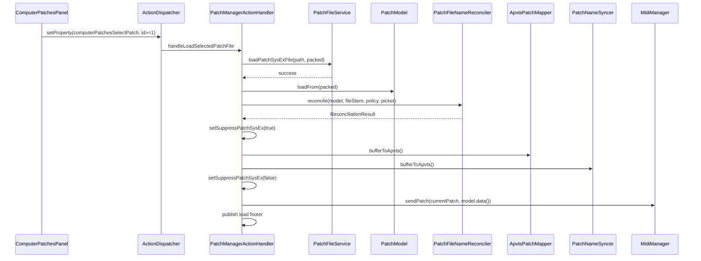

# Story 4.5: Import Name Reconciliation

Status: done

<!-- Ultimate context engine analysis completed — comprehensive developer guide created -->

## Story

As a sound designer,
I want load to apply my reconciliation policy for name vs filename mismatches,
so that imports behave predictably (FR-29).

## Acceptance Criteria

1. **Given** Stories 4.1–4.4 complete (`PatchFileService` scan/save, combobox sentinel FSM, folder persistence, `PatchFileNameSanitizer`, SAVE/SAVE AS) and Story 1.5 complete (`PatchNameSyncer`, `PatchModel::getName` / `setName`) **When** user selects a valid `.syx` from the Computer Patches combobox (`computerPatchesSelectPatch >= 1`) **Then** the selected file is decoded into `PatchModel`, APVTS patch parameters and `patchEditPatchName` are updated, and a **full patch SysEx (opcode 0x01)** is enqueued to the synth via `MidiManager::sendPatch` using the **current internal patch number** (same target as Internal Patches PASTE).
2. **And** after sanitization, if **internal name** (`sanitizeToMatrixName(model.getName())`) **equals** **filename stem** (`sanitizeFileStem(fileNameWithoutExtension)`) **case-insensitively** **Then** the decoded internal name is kept as-is (no policy branch, no reconciliation footer).
3. **And** when names **differ** after sanitization **Then** the persisted Settings policy `settingsComputerPatchesNameReconciliationPolicy` applies **without a mandatory modal** for the default and filename-prefer policies:
   - **Prefer internal name** (default): keep sanitized internal name in bytes 0–7.
   - **Prefer filename**: overwrite bytes 0–7 with sanitized filename stem.
   - **Ask once per load** (opt-in): injected GUI picker on message thread chooses internal vs filename for **this load only**; cancel/invalid picker result aborts load with **no** model/APVTS/MIDI changes.
4. **And** when a mismatch is resolved **silently** (prefer-internal or prefer-filename policies) **Then** an optional **info** footer notice names the applied name (e.g. `"Loaded MY-PATCH (internal name used)"`); no modal.
5. **And** load uses `ActionExecutionHooks` suppress flags (`setSuppressPatchSysEx`, `setSuppressMatrixModSysEx`) around `ApvtsPatchMapper::bufferToApvts()` and `PatchNameSyncer::bufferToApvts()` — same pattern as `handleInternalPatchPaste` / `handleInternalPatchInit` — so APVTS→buffer sync does not enqueue spurious per-parameter SysEx before the final `sendPatch`.
6. **And** invalid/unreadable file, decode failure, stale scan (folder mismatch), or `selectedId` out of range → **warning** footer, patch state unchanged, **no** SysEx sent (mirror save no-op guards).
7. **And** combobox selection change to sentinel (`selectedId == 0`) does **not** trigger load (handler no-op).
8. **And** `PatchFileService` gains a Core load API (e.g. `loadPatchSysExFile`) that reads + validates + `decodePatchSysEx` into a caller buffer; handler owns reconciliation + APVTS/MIDI orchestration.
9. **And** `PatchFileNameReconciler` (or equivalent small Core helper under `Source/Core/Services/`) centralizes mismatch detection + policy application; reuses `PatchFileNameSanitizer` — zero GUI deps except policy enum + pure functions callable from handler.
10. **And** `settingsComputerPatchesNameReconciliationPolicy` is a **persisted** APVTS state property (default = prefer internal); Settings **Policies** section replaces the "Coming soon" placeholder with a combo for the three policies (minimal FR-40 slice — Core must not hard-code policy).
11. **And** **ask-once** policy uses injected `PatchNameReconciliationPicker` (`std::function<std::optional<NameReconciliationChoice>(...)>`) registered from `PluginEditor` (Core ↛ GUI) — parallel to folder/save pickers.
12. **And** load does **not** implement Previous/Next navigation (**Story 4.6**), `DirtyPatchTracker` unsaved warning (**Epic 9**), or mutator history clear (**Epic 6.13** / FR-31 — document hook point only).
13. **And** unit tests cover: names match (no footer); mismatch + prefer-internal; mismatch + prefer-filename; ask-once cancel aborts; ask-once choice applied; invalid file no-op; successful load enqueues patch SysEx; sanitizer reuse. Full `Matrix-Control_Tests` suite passes.

## Tasks / Subtasks

- [x] **Add reconciliation policy IDs** (AC: #3, #10)
  - [x] `PluginIDs::Settings::kComputerPatchesNameReconciliationPolicy` + `NameReconciliationPolicy` enum (`kPreferInternal`, `kPreferFilename`, `kAskOncePerLoad`, `kDefault = kPreferInternal`)
  - [x] `PluginDisplayNames::Settings` labels for combo items
  - [x] Initialize default in `PluginProcessor` state tree (session XML persistence)

- [x] **Wire Settings Policies combo** (AC: #10)
  - [x] Replace `policiesPlaceholder_` in `SettingsPanel` with `TSS::ComboBox` bound to policy property (Common or Plugin tab per existing Policies row layout)
  - [x] Persist selection across sessions

- [x] **Add `PatchFileNameReconciler`** (AC: #2, #3, #9)
  - [x] `Source/Core/Services/PatchFileNameReconciler.{h,cpp}`
  - [x] `struct ReconciliationResult { juce::String resolvedName; bool hadMismatch; bool appliedFilename; }`
  - [x] `reconcile(PatchModel&, juce::String fileStem, NameReconciliationPolicy, optional picker)` — mutates bytes 0–7 per policy
  - [x] `Tests/Unit/PatchFileNameReconcilerTests.cpp`

- [x] **Extend `PatchFileService` load path** (AC: #8)
  - [x] `PatchFileLoadResult { bool success; juce::String errorMessage; }`
  - [x] `loadPatchSysExFile(const juce::File&, juce::uint8* packedOut)` — read, validate, decode
  - [x] `Tests/Unit/PatchFileServiceTests.cpp` — valid fixture round-trip; invalid file

- [x] **Add reconciliation picker injection** (AC: #11)
  - [x] `PatchNameReconciliationPicker` typedef on handler / processor
  - [x] `PluginProcessor::setPatchNameReconciliationPicker(...)`
  - [x] `PluginEditor` — `AlertWindow` or lightweight modal with Internal / Filename / Cancel (message thread)

- [x] **Wire handler load on combobox selection** (AC: #1, #5–#7)
  - [x] Split stub branch: `kSelectPatchFile` → `handleLoadSelectedPatchFile()`
  - [x] Resolve file from `getLastScanResult()` + `selectedId` (reuse save guards: folder match, index bounds)
  - [x] Pipeline: `loadPatchSysExFile` → `model.loadFrom` → `reconcile` → suppress → `bufferToApvts` + `patchNameSyncer` → `sendPatch`
  - [x] `FooterMessages::formatLoadSuccess` / `formatReconciliationNotice` in `PluginDisplayNames.h`
  - [x] Leave `kLoadPreviousPatchFile` / `kLoadNextPatchFile` stub for Story 4.6

- [x] **Self-review** (AC: #12)
  - [x] No prev/next load, DirtyPatchTracker, MutationHistoryStore
  - [x] Methods ≤ 15 lines; English only in source
  - [x] No Computer Patches panel layout changes beyond existing combobox onChange path

## Dev Notes

### What this story IS — and what it is NOT

Story 4.5 delivers **Computer Patches LOAD on combobox selection** with **FR-29 name reconciliation** per D-025.

It must **NOT** in this story:
- Previous/Next file load (**Story 4.6** — FR-52)
- `DirtyPatchTracker` / unsaved-edit modal on load (**Epic 9** — FR-51)
- Clear mutator session history on load (**Epic 6.13** — FR-31; leave `// FR-31 hook` comment where Epic 6 will call `MutationHistoryStore::clear()`)
- Save / rescan / folder persistence changes beyond existing helpers
- Rewrite files on disk to fix name mismatch (reconciliation is in-memory + display only)
- Init template loads (`InitTemplateLoader` — D-040, no D-025)

[Source: epics.md Story 4.5; D-025; FR-29; addendum § Outbound SysEx]

### Load trigger (authoritative)

| Event | Property | Handler | Load? |
|---|---|---|---|
| User picks file in combobox | `computerPatchesSelectPatch` → id ≥ 1 | `handleLoadSelectedPatchFile` | **Yes** |
| Rescan / sentinel reset | `computerPatchesSelectPatch` → 0 via `dontSendNotification` | — | **No** |
| `<` / `>` buttons | `computerPatchesLoadPrevious` / `LoadNext` | stub | **No** (4.6) |

Story 4.2 deliberately deferred load on selection — this story **activates** the existing `ActionPropertyRegistry` entry for `kSelectPatchFile` and the combobox `onChange` → `setProperty` path in `ComputerPatchesPanel.cpp:308-318`.

[Source: `4-2-combobox-sentinel-states.md` AC #4; `ActionPropertyRegistry.cpp:89`]

### Reconciliation rules (D-025)

**Sanitization inputs:**
- **Internal:** `PatchFileNameSanitizer::sanitizeToMatrixName(patchModel.getName())` after decode
- **Filename:** `PatchFileNameSanitizer::sanitizeFileStem(file.getFileNameWithoutExtension())`

**Match test:** `internal.equalsIgnoreCase(filename)` → no policy, no reconciliation footer.

**Mismatch policies:**

| Policy | Bytes 0–7 after load | Modal | Footer |
|---|---|---|---|
| Prefer internal (default) | Sanitized internal | No | Info if mismatch |
| Prefer filename | Sanitized filename stem | No | Info if mismatch |
| Ask once per load | User choice per load | Yes (opt-in policy only) | Success only; cancel → no load |

**RAM / external files:** internal bytes may contain arbitrary data — sanitizer is the fallback when chars are not Matrix-safe (already in `PatchFileNameSanitizer`).

**ROM 2–9 note (D-025):** Computer Patches loads **external** `.syx` files only; internal-name reliability on synth ROM read is out of scope — reconciliation applies to file import path.

[Source: `.decision-log.md` D-025; `addendum.md` § Filename ↔ internal name reconciliation]

### Load pipeline (sequence)



**Order matters:** decode → reconcile (mutates bytes 0–7 only) → suppress → push buffer to APVTS → send **one** full patch SysEx. Do **not** call `apvtsToBuffer()` before load (would overwrite file data with stale edit).

**Patch number for SysEx:** `getCurrentPatch(limits)` — same as `handleInternalPatchPaste` at `PatchManagerActionHandler.cpp:243`.

[Source: addendum § Outbound SysEx — file load → 0x01; `PatchManagerActionHandler.cpp:211-244`]

### Brownfield state (READ before editing)

| File | Current behaviour | This story changes |
|---|---|---|
| `PatchManagerActionHandler.cpp:133-137` | `kSelectPatchFile` → `return; // Epic 4.5 / 4.6` | Implement load for `kSelectPatchFile` only |
| `PatchFileService.h` | Scan + save only | Add `loadPatchSysExFile` |
| `PatchFileNameSanitizer.*` | Save stem sanitization | **Reuse** — do not duplicate |
| `SettingsPanel.cpp:26` | Policies "Coming soon" | Reconciliation policy combo |
| `PluginIDs::Settings` | No reconciliation key | Add policy property + enum |
| `ComputerPatchesPanel.cpp:308-318` | Selection → property only | **No change** (load fires via ActionDispatcher) |
| `PluginEditor.cpp` | Folder + save pickers | Add reconciliation picker |

### Suggested APIs

```cpp
// PluginIDs.h — Settings
namespace NameReconciliationPolicy {
    constexpr int kPreferInternal = 1;
    constexpr int kPreferFilename = 2;
    constexpr int kAskOncePerLoad = 3;
    constexpr int kDefault = kPreferInternal;
}
constexpr const char* kComputerPatchesNameReconciliationPolicy =
    "settingsComputerPatchesNameReconciliationPolicy";

// PatchFileService.h
struct PatchFileLoadResult {
    bool success = false;
    juce::String errorMessage;
};
PatchFileLoadResult loadPatchSysExFile(const juce::File& file, juce::uint8* packedOut);

// PatchFileNameReconciler.h
enum class NameReconciliationChoice { kInternal, kFilename };

struct PatchNameReconciliationResult {
    juce::String resolvedName;
    bool hadMismatch = false;
    bool usedFilename = false;
    bool cancelled = false;  // ask-once only
};

struct PatchFileNameReconciler {
    static PatchNameReconciliationResult reconcile(
        PatchModel& model,
        const juce::String& fileStem,
        int policy,
        const std::function<std::optional<NameReconciliationChoice>(
            juce::String internalSanitized,
            juce::String fileSanitized)>& picker);
};

// PatchManagerActionHandler.h
using PatchNameReconciliationPicker =
    std::function<std::optional<NameReconciliationChoice>(
        juce::String internalSanitized, juce::String fileSanitized)>;
```

```cpp
void PatchManagerActionHandler::handleLoadSelectedPatchFile()
{
    const auto file = resolveSelectedPatchFile();
    if (! file.existsAsFile())
        return;

    juce::uint8 packed[SysExConstants::kPatchPackedDataSize] = {};
    const auto loadResult = patchFileService_->loadPatchSysExFile(file, packed);
    if (! loadResult.success)
    {
        publishLoadFailureFooter(loadResult.errorMessage);
        return;
    }

    patchModel_->loadFrom(packed);

    const auto policy = static_cast<int>(apvts_.state.getProperty(
        PluginIDs::Settings::kComputerPatchesNameReconciliationPolicy,
        PluginIDs::Settings::NameReconciliationPolicy::kDefault));

    const auto recon = PatchFileNameReconciler::reconcile(
        *patchModel_,
        file.getFileNameWithoutExtension(),
        policy,
        pickNameReconciliation_);

    if (recon.cancelled)
        return;

    applyLoadedPatchToApvtsAndSynth(recon);
    publishLoadFooters(file.getFileName(), recon);
}
```

### File read + decode contract

Mirror `InitTemplateLoader::decodePatchIntoModel` but **no InitDefaults fallback** — invalid file = load failure:

```112:142:Source/Core/Init/InitTemplateLoader.cpp
    InitTemplateLoadResult InitTemplateLoader::loadPatchFromFile(PatchModel& model,
                                                                 const juce::File& file) const
    {
        juce::MemoryBlock sysEx;
        if (! loadSysExBytes(file, sysEx))
            return makeFallbackResult(...);

        return decodePatchIntoModel(model, file, sysEx);
    }
```

Computer Patches load: on decode failure → `PatchFileLoadResult{ success=false }` + warning footer; **do not** load InitDefaults.

Reuse `SysExDecoder::validatePatchSysExMessage` before decode (same as scan validation in `PatchFileService::validateFileContents`).

Valid fixture: `Tests/Fixtures/Patches/Patch 71.syx`.

### Reconciliation picker (mandatory for ask-once — Core ↛ GUI)

Mirror save/folder picker pattern:

```cpp
// PluginEditor.cpp — message thread only
pluginProcessor.setPatchNameReconciliationPicker(
    [](juce::String internalName, juce::String fileName)
        -> std::optional<Core::NameReconciliationChoice>
    {
        // AlertWindow: "Patch name mismatch" — Internal / Filename / Cancel
        // Return nullopt on cancel → abort load
    });
```

Default policies **never** call the picker.

### Settings Policies UI (minimal FR-40)

Story 7.7 Phase B listed full Policies consolidation as deferred, but **this story requires a persisted policy property** (AC #10). Replace the Policies placeholder combo only — leave Master Ops / Defrag / Logging as "Coming soon".

Bind combo `onChange` → `apvts.state.setProperty(kComputerPatchesNameReconciliationPolicy, selectedId, nullptr)`.

### Architecture compliance

- **Core ↛ GUI:** decode, reconcile, load orchestration in Core; pickers + Settings combo in GUI only.
- **Composition root:** `PluginProcessor` wires picker + passes to handler (AD-2).
- **Separate from InitTemplateLoader:** Computer Patches load ≠ INIT (D-040).
- **Threading:** synchronous on message thread (acceptable v1 — same as scan/save).
- **Idempotency:** re-selecting same file re-loads and re-sends SysEx (acceptable v1; DirtyPatchTracker will gate in Epic 9).

### File structure (this story)

```
Source/Core/Services/
├── PatchFileNameReconciler.h          (NEW)
├── PatchFileNameReconciler.cpp        (NEW)
├── PatchFileService.h                 (UPDATE — load API)
└── PatchFileService.cpp               (UPDATE — loadPatchSysExFile)

Source/Core/Actions/
├── PatchManagerActionHandler.h        (UPDATE — load handler, picker dep)
└── PatchManagerActionHandler.cpp      (UPDATE — handleLoadSelectedPatchFile)

Source/Core/
├── PluginProcessor.h                  (UPDATE — setPatchNameReconciliationPicker)
└── PluginProcessor.cpp                (UPDATE — wire picker + default policy)

Source/GUI/
├── PluginEditor.cpp                   (UPDATE — reconciliation picker)
└── Settings/SettingsPanel.h/.cpp    (UPDATE — policy combo)

Source/Shared/Definitions/
├── PluginIDs.h                        (UPDATE — policy property + enum)
└── PluginDisplayNames.h               (UPDATE — Settings labels + load footers)

Tests/Unit/
├── PatchFileNameReconcilerTests.cpp   (NEW)
├── PatchFileServiceTests.cpp          (UPDATE — load)
└── PatchManagerActionHandlerTests.cpp (UPDATE — load + reconciliation)
```

Register new `.cpp` files in plugin + `Matrix-Control_Tests` `CMakeLists.txt`.

### Testing requirements

| Test | Setup | Assert |
|---|---|---|
| `reconcile_namesMatch` | Internal `BASS` + file `BASS.syx` | `hadMismatch=false`, name unchanged |
| `reconcile_preferInternal` | Internal `INSIDE` + file `OUTSIDE.syx` | name=`INSIDE`, footer-worthy |
| `reconcile_preferFilename` | policy filename | name=`OUTSIDE` |
| `reconcile_askOnceCancel` | picker returns nullopt | model unchanged, no SysEx |
| `reconcile_askOnceFilename` | picker returns Filename | name from file |
| `loadPatchSysExFile_validFixture` | Patch 71.syx | success, packed non-zero |
| `loadPatchSysExFile_invalid` | master .syx or garbage | success=false |
| `loadSelected_enqueuesSysEx` | Handler harness + temp valid file | queue non-empty after load |
| `loadSelected_staleScanNoOp` | folder path mismatch | no load |
| `loadSelected_sentinelNoOp` | selectedId=0 | handler not called / no-op |

Use `HandlerHarness` from `PatchManagerActionHandlerTests` — extend with fake reconciliation picker, temp scan dirs (Story 4.3/4.4 patterns), `MidiOutboundQueue` inspection (Story 4.4 `testSaveAs_noSysEx` inverted).

### Previous story intelligence (Story 4.4)

| Learning | Application in 4.5 |
|---|---|
| `PatchFileNameSanitizer` in Core Services | **Reuse** for both stems in reconciliation — do not fork charset logic |
| `indexOfFileNameIgnoreCase` | Not needed for reconciliation; useful if post-load selection sync added |
| Suppress hooks around buffer→APVTS | Same pattern mandatory before `sendPatch` |
| `resolveRescanFolder` / scan folder guards | Reuse for `resolveSelectedPatchFile` path validation |
| Save must not trigger load | Load must not trigger save/rescan |
| Review: restore state on failure | If reconcile cancel or decode fail, never partially update APVTS |

### Previous story intelligence (Story 4.2)

| Learning | Application in 4.5 |
|---|---|
| `computerPatchesSelectPatch` 1-based index | `sortedValidFileNames[selectedId - 1]` |
| Sentinel `selectedId == 0` | Handler early-return |
| `dontSendNotification` on rescan | Prevents accidental load storms |
| Combobox onChange only when `selectedId >= 1` | Matches load precondition |

### Previous story intelligence (Story 1.5)

| Learning | Application in 4.5 |
|---|---|
| `PatchNameSyncer::bufferToApvts()` | Call after reconciliation so PATCH NAME displays resolved name |
| `PatchModel::setName` encodes charset | Reconciler calls `setName` with sanitized string only |
| Do not read APVTS name before load | Load from file buffer first, then reconcile, then sync to APVTS |

### Git intelligence (recent commits)

`3c28321` — Story 4.4: `PatchFileNameSanitizer`, `savePatchSysExFile`, handler save path, picker injection. Load should mirror save's service boundary (service owns file I/O + decode; handler owns model/APVTS/MIDI).

`6693cea` / `4d73254` / `5bed772` — Scan cache + combobox FSM. Load reads from `getLastScanResult()`; validate folder still matches persisted path before decode.

### Latest tech information

- **JUCE 8.0.12** — `File::loadFileAsData` for read; `AlertWindow::showOkCancelBox` or custom modal for ask-once picker on message thread.
- **SysEx** — full patch replace uses `MidiManager::sendPatch(patchNumber, packedData)` → encoder patch opcode 0x01 (addendum D-044).
- **No new dependencies.**

### Project context reference

- `Core ↛ GUI` strict [project-context.md]
- Clean Code: methods ≤ 15 lines, classes ≤ 200 lines [CONVENTIONS.md]
- English only in source/comments [project-context.md]
- Tests: JUCE `UnitTest`, fixtures under `Tests/Fixtures/` [project-context.md]

### References

- [Source: `_bmad-output/planning-artifacts/epics.md` — Epic 4 Story 4.5, FR-29]
- [Source: `_bmad-output/planning-artifacts/prds/prd-Matrix-Control-2026-05-25/prd.md` — FR-29, FR-40]
- [Source: `_bmad-output/planning-artifacts/prds/prd-Matrix-Control-2026-05-25/.decision-log.md` — D-025]
- [Source: `_bmad-output/planning-artifacts/prds/prd-Matrix-Control-2026-05-25/addendum.md` — D-025 policies, outbound SysEx table]
- [Source: `implementation-artifacts/4-4-save-with-filename-injection.md` — sanitizer, save pipeline, review learnings]
- [Source: `implementation-artifacts/4-2-combobox-sentinel-states.md` — selection property, deferred load]
- [Source: `implementation-artifacts/4-1-patchfileservice-folder-scan.md` — validation contract]
- [Source: `implementation-artifacts/7-7-settings-page-consolidation.md` — Policies section placeholder]
- [Source: `Source/Core/Actions/PatchManagerActionHandler.cpp:133-137` — stub to replace]
- [Source: `Source/Core/Init/InitTemplateLoader.cpp` — decode pattern (no fallback for library load)]
- [Source: `Source/Core/Models/PatchModel.h:37-41` — name API]
- [Source: `Source/Core/MIDI/MidiManager.cpp:212-228` — sendPatch]

## Dev Agent Record

### Agent Model Used

claude-4.6-sonnet-medium-thinking

### Debug Log References

- Fixed `loadSelected_enqueuesSysEx` expectation: Patch 71 fixture internal name (`BNK2 71`) differs from filename stem (`PATCH 71`), so default prefer-internal policy emits reconciliation footer, not plain load success.

### Completion Notes List

- Implemented Computer Patches LOAD on combobox selection (`computerPatchesSelectPatch >= 1`) with full pipeline: decode → reconcile → suppress APVTS SysEx → bufferToApvts + PatchNameSyncer → sendPatch.
- Added `PatchFileNameReconciler` (Core, zero GUI) with prefer-internal, prefer-filename, and ask-once-per-load policies reusing `PatchFileNameSanitizer`.
- Added `PatchFileService::loadPatchSysExFile` for read/validate/decode without InitDefaults fallback.
- Persisted `settingsComputerPatchesNameReconciliationPolicy` APVTS property (default prefer-internal) with Settings Policies combo.
- Injected `PatchNameReconciliationPicker` from `PluginEditor` via `AlertWindow` for ask-once policy.
- Cancel on ask-once restores pre-load model buffer; invalid file shows warning footer with no state/MIDI changes.
- Added unit tests: reconciler (5), PatchFileService load (2), handler load/reconciliation (7). Full `Matrix-Control_Tests` suite passes; `Matrix-Control_Standalone` builds.

### File List

- CMakeLists.txt
- Source/Core/Actions/PatchManagerActionHandler.cpp
- Source/Core/Actions/PatchManagerActionHandler.h
- Source/Core/PluginProcessor.cpp
- Source/Core/PluginProcessor.h
- Source/Core/Services/PatchFileNameReconciler.cpp
- Source/Core/Services/PatchFileNameReconciler.h
- Source/Core/Services/PatchFileService.cpp
- Source/Core/Services/PatchFileService.h
- Source/GUI/PluginEditor.cpp
- Source/GUI/Settings/SettingsPanel.cpp
- Source/GUI/Settings/SettingsPanel.h
- Source/Shared/Definitions/PluginDisplayNames.h
- Source/Shared/Definitions/PluginIDs.h
- Tests/Unit/PatchFileNameReconcilerTests.cpp
- Tests/Unit/PatchFileServiceTests.cpp
- Tests/Unit/PatchManagerActionHandlerTests.cpp
- _bmad-output/implementation-artifacts/sprint-status.yaml

### Change Log

- 2026-06-19: Code review — AC #6 warning footers on stale selection, method refactors (≤15 lines), missing tests added.

### Review Findings

- [x] [Review][Decision] Méthodes > 15 lignes (AC #12) — Refactoré : helpers extraits (`resolveSelectedPatchFileForLoad`, `decodeAndReconcilePatchFile`, `reconcileAskOnce`, `syncLoadedPatchToApvts`, etc.).

- [x] [Review][Patch] Scan périmé / index hors plage → pas de footer warning (AC #6) [PatchManagerActionHandler.cpp] — `resolveSelectedPatchFileForLoad` + `publishLoadFailureFooter` avec `kLoadSelectionStale` / `kPatchFileNotFound`.

- [x] [Review][Patch] Test stale scan incomplet (AC #6, #13) [PatchManagerActionHandlerTests.cpp] — assert footer warning ajouté.

- [x] [Review][Patch] Test index hors plage manquant (AC #6, #13) [PatchManagerActionHandlerTests.cpp] — `testLoadSelected_outOfRangeWarning` ajouté.

- [x] [Review][Patch] Test sanitizer reuse manquant (AC #13) [PatchFileNameReconcilerTests.cpp] — `reconcile_sanitizerReuse` ajouté.

- [x] [Review][Defer] CONVENTIONS.md hors périmètre story [CONVENTIONS.md] — deferred, pre-existing : section BMad titres agents mélangée au diff fonctionnel 4.5.

- [x] [Review][Defer] `AlertWindow::runModalLoop` synchrone [PluginEditor.cpp:132] — deferred, pre-existing : premier modal du projet ; migration async JUCE 8 reportée.
